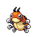
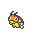
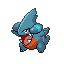
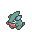
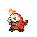
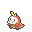

# 配信

点击卡片上的「领取」前往水银 HOME 自动导入。导入后记得在 HOME 里点「保存」。

<strong>梦想成为假面骑士的芭瓢虫　芭瓢虫 Lv.5 ♀</strong>

特性：大力士（梦特） · 性格：慎重 · 个体：6V · 球种：究极球 · 初训家：埋葬

撞击、超音波

<a class="dist-claim" href="../home/app.html?key=PMH1.MAAAADHUAAABJAprAmj_AAAAAAAJKw_t_wAAAKUAAABkAAAAADIZIcAAAAAAAAAAAAAAAAAA____vw">领取</a>

手动密钥
<code>PMH1.MAAAADHUAAABJAprAmj_AAAAAAAJKw_t_wAAAKUAAABkAAAAADIZIcAAAAAAAAAAAAAAAAAA____vw</code>

<strong>竹兰的圆陆鲨　圆陆鲨 Lv.5 ♂</strong>

特性：粗糙皮肤（梦特） · 性格：固执 · 个体：6V · 球种：高级球 · 初训家：竹兰

龙之舞、咬住、抓、拍击

<a class="dist-claim" href="../home/app.html?key=PMH1.gAAAAAEAAAAPvgjuHeD_AAAAAAAQwggx_wAAAPABAACGAAAAADIBXbGgQAAAAAAAAAAAAAAA____vw">领取</a>

手动密钥
<code>PMH1.gAAAAAEAAAAPvgjuHeD_AAAAAAAQwggx_wAAAPABAACGAAAAADIBXbGgQAAAAAAAAAAAAAAA____vw</code>

<strong>壮壮妈　呆火鳄 Lv.5 ♂</strong>

特性：猛火 · 性格：内敛 · 个体：6V · 球种：梦境球 · 初训家：埋葬

撞击、瞪眼、火花

<a class="dist-claim" href="../home/app.html?key=PMH1.KAAAADHUAAAC1AV9HfH_AAAAAAAJKw_t_wAAAIMFAACGAAAAADIaIaxAAwAAAAAAAAAAAAAA____Pw">领取</a>

手动密钥
<code>PMH1.KAAAADHUAAAC1AV9HfH_AAAAAAAJKw_t_wAAAIMFAACGAAAAADIaIaxAAwAAAAAAAAAAAAAA____Pw</code>

<strong>壮壮妈　呆火鳄 Lv.5 ♂</strong>

特性：猛火 · 性格：内敛 · 个体：6V · 球种：梦境球 · 初训家：埋葬

撞击、瞪眼、火花

<a class="dist-claim" href="../home/app.html?key=PMH1.KAAAADHUAAD_____________AAAJKw_t_wAAAIMFAACGAAAAADIaIaxAAwAAAAAAAAAAAAAA____Pw">领取</a>

手动密钥
<code>PMH1.KAAAADHUAAD_____________AAAJKw_t_wAAAIMFAACGAAAAADIaIaxAAwAAAAAAAAAAAAAA____Pw</code>

<strong>壮壮妈　呆火鳄 Lv.5 ♂</strong>

特性：猛火 · 性格：内敛 · 个体：6V · 球种：梦境球 · 初训家：埋葬

撞击、瞪眼、火花

<a class="dist-claim" href="../home/app.html?key=PMH1.KAAAADHUAAD_____________AAAJKw_t_wAAAIMFAACGAAAAADIaIaxAAwAAAAAAAAAAAAAA____Pw">领取</a>

手动密钥
<code>PMH1.KAAAADHUAAD_____________AAAJKw_t_wAAAIMFAACGAAAAADIaIaxAAwAAAAAAAAAAAAAA____Pw</code>

