# 公告

---

## 《宝可梦 水银》Version 1.3.3 更新公告

2026-10-08

### 修复与优化

修复与凤王的对战结束后，有概率无法推进剧情的问题。

### 下载（v1.3.3） {#v133}

下载链接与提取码保持不变。

| 渠道 | 链接 |
|---|---|
| 百度网盘 | [宝可梦 水银](https://pan.baidu.com/s/1j4tAOI8GKWcKDi_lBirClg)（提取码: `69G1`） |
| 蓝奏云 | [下载](https://wwapo.lanzouv.com/b004jrjabc)（密码: `egea`） |

---

## 《宝可梦 水银》Version 1.3.2 更新公告

2026-10-08

### 修复与优化

优化满金市地下仓库的地图，防止玩家被 NPC 卡住、无法离开。

### 下载（v1.3.2） {#v132}

下载链接与提取码保持不变。

| 渠道 | 链接 |
|---|---|
| 百度网盘 | [宝可梦 水银](https://pan.baidu.com/s/1j4tAOI8GKWcKDi_lBirClg)（提取码: `69G1`） |
| 蓝奏云 | [下载](https://wwapo.lanzouv.com/b004jrjabc)（密码: `egea`） |

---

## 《宝可梦 水银》Version 1.31 更新公告

2026-10-08

### 修复与优化

1. 修复努力值调整时强制使用努力药、羽毛一次最多只能使用 9 个的问题。现在会优先使用已有的努力药，不足的部分由对应羽毛补齐；没有努力药时，也可以用 252 个羽毛一次将对应努力值从 0 调整到 252。
2. 补充超级进化的解锁时机与使用条件，以及任务系统、挖矿、大量出现等帮助说明，精简部分帮助条目。
3. 新增功能解锁后的帮助提示，引导查看对应的帮助贴士；同时调整“妈妈存钱”等提示的出现时机。已有存档中已解锁的功能不会在读档时集中补弹提示。

### 下载（v1.31） {#v131}

下载链接与提取码保持不变。

| 渠道 | 链接 |
|---|---|
| 百度网盘 | [宝可梦 水银](https://pan.baidu.com/s/1j4tAOI8GKWcKDi_lBirClg)（提取码: `69G1`） |
| 蓝奏云 | [下载](https://wwapo.lanzouv.com/b004jrjabc)（密码: `egea`） |

---

## 《宝可梦 水银》Version 1.3 更新公告

### 新增

1. 新增了调整努力值的功能
2. 新增了一个开关，打怪可以不获得努力值，而是获得对应努力值的羽毛，快速战斗中也有概率掉落羽毛。携带学习装置的情况，掉落羽毛数量会 × 队伍宝可梦的数量（力量套装也生效）
3. 新增帮助系统和成就系统

### 优化

1. 优化了菜单的显示和操作
2. 通过配信、交换的宝可梦也可以修改昵称了
3. 交换宝可梦的 NPC 可以重复交换了，避免木木枭支线里送出无法再获得
4. 格斗道馆的解谜增加了提示
5. 龙穴的漩涡增加了提示
6. 优化了幽灵道馆的解谜提示
7. 增加了拉姆达的战斗中台词
8. 调整了幻影森林中绿色头巾的位置，避免不够明显
9. 战斗中的消耗道具在战斗结束后会返还

### 修复 BUG

1. 修复了支线任务《狂暴的宝可梦》和《黑曜与钢铁》会自动完成的问题
2. 修复了满金市过场剧情中玩家显示错误的问题
3. 修复了用银色王冠极限锻炼会消耗金色王冠的问题
4. 修复了小偷无法偷到训练家道具的问题
5. 修复了结尾字幕偏移错误的问题

### 更新演示

<figure>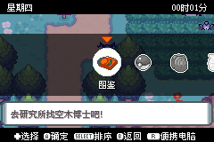<figcaption>菜单显示和操作</figcaption></figure>
<figure>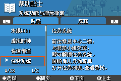<figcaption>帮助系统</figcaption></figure>
<figure>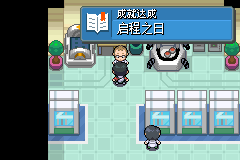<figcaption>成就系统 · 启程之日</figcaption></figure>
<figure>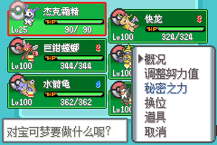<figcaption>调整努力值</figcaption></figure>
<figure>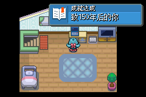<figcaption>成就系统 · 致150年后的你</figcaption></figure>
<figure>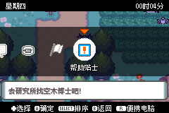<figcaption>菜单中的帮助入口</figcaption></figure>

### 下载（v1.3）

| 渠道 | 链接 |
|---|---|
| 百度网盘 | [宝可梦 水银](https://pan.baidu.com/s/1j4tAOI8GKWcKDi_lBirClg)（提取码: `69G1`） |
| 蓝奏云 | [下载](https://wwapo.lanzouv.com/b004jrjabc)（密码: `egea`） |

### 想对大家说的话

国庆假期即将过去，一段时间以内应该不会再更新了，后续也将潜心于后续内容的制作，同时一些问题也许不能够即时回答大家了，请见谅。

这段时间收到了大家的很多游玩意见、反馈和感想，说实话，真的非常感动。说实话，在发布前，我还是感到焦虑，毕竟那么多优秀以城都为题材的作品珠玉在前，我的故事真的能得到大家的喜爱吗？

但是看到有人为转瞬即逝的美好而停留，也看到有人在人生低谷期因为这段旅途感受到了温暖与爱，真的感到那数不清的日夜全都值得了。毕竟，没有什么比自己能通过创作去触碰那么多同频的灵魂、去传递纯粹的感动与力量更让人觉得幸福的事了。

看见有人说，水银充实了自己的国庆假期，我也想说，这也是我过得最幸福的国庆假期，也许这就是人与人之间通过宝可梦而连接吧。千言万语化作一句，谢谢大家！能制作水银，真是太好了。

我也理解一下为故事后续走向而感到焦急的朋友，我也理解大家的心情。因为我也是一个感性的人，在写一些剧情的台本时，也经常是写着就哭了。但我想说，地球是圆的，总有一天会再相见的！

---

## 《宝可梦 水银》Version 1.2 更新公告

更新内容：

1. 修复了纯白冻土隐藏道具无法拾取的问题
2. 修复了技能「巨力锤」没有伤害的问题
3. 修复了技能「精神噪音」没有伤害的问题
4. 修复了「冷笑话」只能下雪、不能替换上场的问题
5. 去除了「闪焰高歌」替换 BGM 的效果
6. 新增特性「锋锐」，艾路雷朵 MEGA 的特性改为锋锐
7. 修复了硬币数超过 65535 判定会出问题的问题
8. 修复了双打时查看队友概况可能卡死的问题
9. 菊草叶升级技 Lv11 新增「原始之力」，Lv17 新增「生长」
10. 调整了牧场任务的传送点，避免导致主线剧情卡死
11. 新增虚拟时钟选项，游戏内时间不再与现实时间同步，并且玩家可以调整流速
12. 背包分类扩充，分为回复道具、培育道具、携带道具等
13. 新增快速战斗选项：明雷的情况下，如果等级高于当前明雷 5 级以上，可直接战斗外战胜并获取奖励
14. 新增任务概况功能，在任务界面按下 SELECT 按钮，可以查看当前任务概览和进度
15. 菜单新增「消磨时间」，在虚拟时钟的情况下，可以快速流动时间至特定时间段
16. 修复了野外捕捉未知图腾无法登录至日志的问题
17. 优化了明雷的刷新：会检测周围至少有一个可移动且空闲的四邻格，否则刷新失败
18. 增加 BOSS 战中护盾出现的次数上限，最多 4 次
19. 修复了擂钵山的弃世猴在周六而不是周日刷新的 BUG
20. 修复了缘朱市钥匙隐藏道具可能会莫名消失的问题

<figure>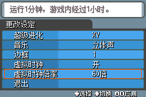<figcaption>11. 虚拟时钟（可调流速）</figcaption></figure>
<figure>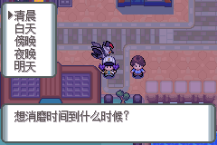<figcaption>15. 消磨时间</figcaption></figure>
<figure>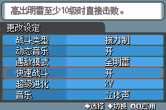<figcaption>13. 快速战斗设置</figcaption></figure>
<figure>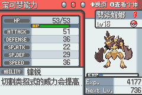<figcaption>6. 艾路雷朵 MEGA「锋锐」</figcaption></figure>
<figure>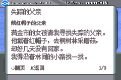<figcaption>14. 任务概况（SELECT）</figcaption></figure>
<figure>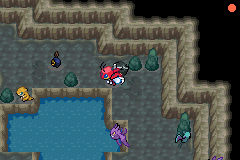<figcaption>13/17. 明雷与快速战斗</figcaption></figure>

### 下载（v1.2）

| 渠道 | 链接 |
|---|---|
| 百度网盘 | [宝可梦 水银](https://pan.baidu.com/s/1j4tAOI8GKWcKDi_lBirClg)（提取码: `69G1`） |
| 蓝奏云 | [下载](https://wwapo.lanzouv.com/b004jrjabc)（密码: `egea`） |

---

## 《宝可梦 水银》Version 1.1 更新公告

更新内容：

1. 洗翠千针鱼「毒千针」的学习等级调整为 Lv.25
2. 完成阿球的支线任务后改为传送回满金市，避免导致后续 CosPlay 大会支线时序错误
3. 安瓢虫所有特性都调整为「全能变身」
4. 优化极巨战和 MEGA 战的护盾量和多动概率
5. 修复拿到满金道馆徽章后菜单提示不更新的问题
6. 取消异ID宝可梦听话等级限制
7. 修复纯白冻土隐藏道具无法拾取的问题
8. 大竺葵升级技新增「气象球」
9. 火暴兽升级技新增「热沙大地」，遗传招式新增「日光束」
10. 大力鳄升级技新增「波动冲」
11. 改为在获得皮丘后才可以打开电脑领取配信，防止配信宝可梦的技能被皮丘的技能覆盖
12. 精灵爷爷的支线去除了徽章检测，一开始就可以领取通信电缆，以防后面忘记
13. 修复了未解锁 MEGA 就有钥石充满能量提示的问题
14. 增加未知图腾「！」和「？」的权重
15. 修复了安卓模拟器使用培育屋取出宝可梦有概率卡死的问题

### 下载（v1.1）

| 渠道 | 链接 |
|---|---|
| 百度网盘 | [宝可梦 水银](https://pan.baidu.com/s/1j4tAOI8GKWcKDi_lBirClg)（提取码: `69G1`） |
| 蓝奏云 | [下载](https://wwapo.lanzouv.com/b004jrjabc)（密码: `egea`） |

---

## 【发布】《宝可梦 水银》FC~「致150年后的你」

2026-09-28 · 来源：<a href="https://www.bilibili.com/opus/1252832734680711169">哔哩哔哩</a>

### 声明

本项目为基于《宝可梦 火红》制作的非盈利性质ROM改版游戏，剧情与内容基于《宝可梦 金/银/水晶》及《宝可梦 心金/魂银》（GSC/HGSS）进行二次创作。

《宝可梦》系列相关IP、角色、世界观、音乐及美术素材等版权均归属于任天堂（Nintendo）、Game Freak及Creatures Inc.所有。

本改版游戏完全免费公开发布，仅供同好交流与学习使用。严禁任何个人或组织进行任何形式的商业化行为，包括但不限于：倒卖实体卡带、刻录售卖、整合至收费模拟器、设立收费墙（如付费群、赞助可见等）或将本项目用于任何盈利目的。如果您是付费获取了本游戏，请立刻退款并举报卖家！

### 引言

很久很久以前，缘朱的人们修建了两座高塔：铃铛塔，与钟之塔。两座塔分立东西两侧，为了人类与宝可梦的友谊而修建。某天，拥有七色翅膀的传说宝可梦降临于铃铛塔之上，人们试着与它沟通，最终与它建立了深厚的友谊。直到150年前，那个月光照耀的命运之夜——

落雷迸发的火舌吞噬了高耸的巨塔，大火烧了三天三夜，直到缘朱高天降下一场大雨。三只不知名的宝可梦在那场大火中丧生，将它们复活的，是那只从天而降的彩虹色宝可梦。可城镇上的人们畏惧那份力量，想用暴力将其制服……

这段令人唏嘘的传说，城都地区的每个人都耳熟能详。

但历史的灰烬中，总有一些未被传唱的真相。人们只记得神明的震怒与离去，却遗忘了在那绝望的漫漫长夜里，曾有人在废墟中吹响笛声，用舞蹈与祈愿安抚了狂暴的宝可梦，在黑暗中重新点燃了微光。那份拼尽全力也要守护彼此的心意，并未在那场大火中消散，而是跨越了漫长的时光，化作了一颗等待被唤醒的种子。

而这，正是由150年后的你，亲自开启的故事。

——《宝可梦 水银》 FirstChapter 致150年后的你

### 介绍

《宝可梦 水银》是以《宝可梦 火红》为蓝本、基于 CFRU（Complete Fire Red Upgrade）引擎开发的 GBA 中文改版，剧情与内容则是基于《宝可梦 金/银/水晶》及《宝可梦 心金/魂银》（GSC/HGSS）二次创作。

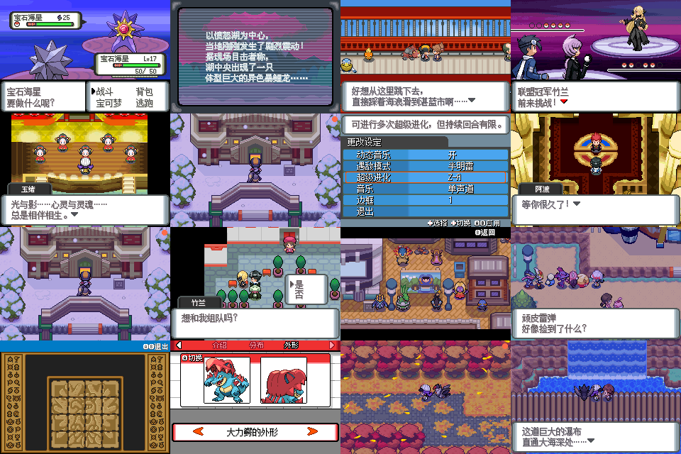

本次发布包含：

- 完整的一周目主线剧情
- 对战塔
- 97个支线任务
- 截止第九世代的宝可梦（朱/紫）
- 《宝可梦传说 Z-A》新增的超级进化宝可梦（一周目无法获得全部宝可梦）
- 技能池同步至第九世代（朱紫/ZA）（一周目无法全部获得，同上）
- 类似《宝可梦传说 Z-A》的Mega机制（游戏中可选）
- 跟随、同步器、明雷（游戏中可选）
- 华丽大赛、秘密基地等旁支玩法

<figure>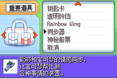<figcaption>同步器</figcaption></figure>
<figure>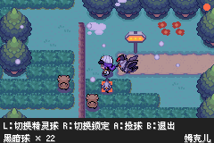<figcaption>地图捕捉</figcaption></figure>
<figure>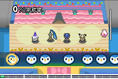<figcaption>华丽大赛</figcaption></figure>
<figure>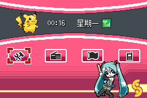<figcaption>精灵齿轮</figcaption></figure>
<figure>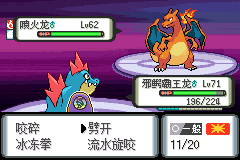<figcaption>实机演示</figcaption></figure>
<figure>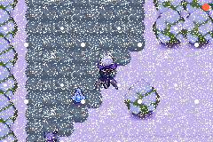<figcaption>实机演示</figcaption></figure>

### 下载

!!! warning "版本更新"
    已有 **Version 1.3.3**，请使用[上方的最新下载链接](#v133)。

| 渠道 | 链接 |
|---|---|
| 百度网盘 | [宝可梦水银FC~致150年后的你 Version 1.0.gba](https://pan.baidu.com/s/1PLIvP_928jurJZEAcOrNYw?pwd=c7et)（提取码: `c7et`） |
| 蓝奏云 | [下载](https://wwapo.lanzouv.com/ijd7e4a6cxja)（密码: `b27i`） |

**交流群**：1群 `534774534` · 2群 `300578495` · 测试群 `435803246` · 口袋改版资源吧官方群 `1091812268`

### 游玩须知

**一、关于游戏性质与设定底线**

《宝可梦 水银》是基于官方正作《宝可梦 火红》制作的非官方同人改版游戏。本作中包含大量原创的剧情走向、世界观拓展及独立系统。请务必注意：切勿将本作中的任何同人设定、人物关系及机制代入或混淆至宝可梦官方设定中。

**二、游玩门槛与受众建议**

由于本作在剧情和设定上存在较多深度的彩蛋与联动，极不建议未接触过宝可梦系列官方正作的玩家将本作作为入坑首选。

为获得最完整的剧情体验，强烈建议您在游玩本作前，至少体验过以下官方作品：

- 《宝可梦 金/银/水晶版》或《宝可梦 心金/魂银》
- 《宝可梦 钻石/珍珠/白金》

此外，若您曾通关过《宝可梦传说 阿尔宙斯》、《宝可梦传说 Z-A》以及《宝可梦 欧米伽红宝石/阿尔法蓝宝石》，将会对本作的暗线剧情有更深层次的理解。

**三、严正的非盈利声明**

《宝可梦 水银》为完全免费的非盈利性同人交流作品，仅供宝可梦爱好者学习与娱乐，严禁用于任何商业牟利行为。如果您在获取本作的任何渠道中支付了金钱，说明您已经遭遇了诈骗。请立刻要求退款并举报该倒卖者。

**四、推荐模拟器环境**

为确保游戏底层代码的稳定运行，请务必使用以下经过充分测试的推荐模拟器：

- PC端：强烈建议使用 mGBA
- Android（安卓）端：建议使用 My Boy! 或 Pizza Boy
- iOS（苹果）端：建议使用 Delta

【警告】：强烈不建议使用 VBA（VisualBoyAdvance）等其他老旧或兼容性欠佳的模拟器游玩，否则极易出现画面撕裂或卡死现象。

**五、关于存档与系统时间的重要警告**

在游玩过程中，请务必养成勤存档的好习惯，且必须使用游戏内菜单的正常存档功能（即电池存档）。

强烈不建议过度依赖模拟器的"即时存档（Save States）"功能。**绝对禁止随意修改设备的系统时间。**

以上违规操作极易导致游戏内存数据读取混乱，进而引发不可控的恶性BUG甚至造成永久性坏档。

**六、视听体验升级说明**

目前在引擎优化下，除 Delta 模拟器外，本作已全面支持 BGM（背景音乐）随游戏倍速同步变化的功能。

注：此功能需通过模拟器的倍速设置触发，单纯长按键盘空格键加速无法实现BGM同步。

我们在本作的音乐编排上倾注了大量的心血，请各位玩家尽情享受旅途中的音乐！

!!! note "相关名单"
    **作者**：埋葬_official（夏影）

    **制作协力**（排名不分先后）

    - 美术：整理控、虚空、猫猫、华雄5、大姐姐姐、安德鲁、乐乐子、Origmal、NaNa、奈落叶腐、断月、新月、我不污、鸣微、寄、触龙、白く照り映える月、RED、天骷上人
    - 脚本：华雄5、会飞的鱼、Chaotix、八音轨仙人、瓦吉
    - 地图：华雄5、会飞的鱼、离个海、二胖、霸道胖虎、河山水长、小米饭
    - 剧情：猫猫、兔砸博士、蛤蟆、芥川君、江不二、雨野
    - 程序：幻魂小泡、咖喱酱、明雅
    - 音乐：陆思维、SKT、Lin Hooo

    **特别感谢**：神SOK、海のLUGIA、绿叶枫、卧看微尘、摆烂、鸽无安、星夜之幻、C_型血、Xzonn、CKN&DMG&口袋群星SP、可达鸭汉化组、ACG汉化组

    本作的开发，建立在这些公开资源与贡献者的工作之上：首先要特别感谢 Complete Fire Red Upgrade（CFRU）与 CFRU-Expansion 两套引擎的作者和贡献者们。

    - 引擎与代码：Skeli / Skeli789（Complete Fire Red Upgrade、Dynamic Pokemon Expansion）、Shiny-Miner、JPAN、DizzyEggg、Jaizu、agsmgmaster64
    - 系统、动画与动态调色：ghoulslash、Navenatox、Lixdel、BadgerLordZeus
    - 冲浪 Overworld 素材：Avara、Slawter666、Hestia、eMMe97
    - 社区：pret（pokefirered）、Rom Hacking Hideout（pokeemerald-expansion）、Team Aqua's Hideout、Bulbapedia、口袋改版资源吧

    音乐素材（本作部分 BGM 改编／引用自以下作品）：《轨迹》系列（Falcom）、《女神异闻录》系列（Atlus）、《传说》系列（Bandai Namco）、《异度》系列（Monolith Soft）、《月姬》（TYPE-MOON）、《AIR》（Key）、《塞尔达传说》系列（Nintendo）

    启发本作的一些改版作品：Pokemon Unbound、Pokemon Dark Purple、Pokemon Liquid Crystal、Pokemon Crystal Dust、Pokemon Shiny Gold、ポケットモンスターゴールデンサン、Pokemon Polished Crystal

### 个人感想

回忆是珍珠，友情是钻石。

今天是2026年9月28日，同样也是《宝可梦 钻石/珍珠》发售20周年的日子。整整二十年过去了。《珍珠/钻石》一直是我个人最喜欢的一代，没有之一。神奥地区总是带着一种冷冽而宁静的质感——那是天冠山上呼啸的暴风雪，是神话学者笔下厚重的远古残卷，是夜晚双叶镇、祝庆市里流淌着的舒缓钢琴声。那抹冷淡的蓝调深深烙印在我的童年里。

与此同时，城都地区在我心中同样有着无法替代的分量。如果说神奥带给我的是深邃宏大的神话震撼与独特的冷感，那么城都给予我的，则是最纯粹的归属感与诗意——那是圆朱市踩着落叶的清脆声响，是铃铛塔顶随风摇曳的风铃，是神社、古刹与历史代代相传的厚重沉淀。可以说，由DPPT与HGSS共同筑起的第四世代，彻底改变了我的人生。

而我人生中与宝可梦改版的两次交汇，全部都绕不开第四世代。

最早接触改版是在2010年。我总想着如果能在传统的2D像素世界里，看到更多关于神奥、城都交织的历史与羁绊该有多好。带着这份憧憬，我在2012年正式立项，开始摸索着开发《水银》。但那时的技术还很稚嫩，加上后来学业的重压，这个项目在漫长的时间里走走停停，最终被封存进硬盘的角落。

上了大学后，我一度陷入迷茫。大二上学期正值《宝可梦 晶灿钻石/明亮珍珠》（BDSP）发售，我第一时间购入了它。我曾经发表一个连自己都知道会被骂的"暴论"：BDSP是我在NS上最喜欢的一作宝可梦。它那原汁原味的二头身还原，让我时隔多年再次真切感受到了神奥那抹熟悉的冷感，以及——像素画留给我们的无尽遐想。

打败竹兰后，看着BDSP通关动画里夕阳西下，主人公独自一人骑单车回家，天空中飘飘球划过的一瞬间，我仿佛瞬间被拽回了小学时通关DP的那个下午，眼泪止不住地涌了出来。

那一刻，我终于想起来了，我真正想要做的到底是什么：我也想要创造这样一个如魔法般美妙的幻想世界；我也想要用作品，将自己想要表达的事物传达到他人的内心；我也想要，在多年之后，我的作品能够成为他人心中美好的回忆。

怀着这样的心情，在通关BDSP后的2022年，我重拾了因学业中断的《水银》，开始没日没夜地钻研。除了上课之外，我几乎都是把自己关在寝室，断绝了一切的社交活动；毕业后工作，也是一下班就投入到开发，常常熬到凌晨三、四点才睡。这样的作息，不知不觉维持了整整四年多。

**游戏设计方面的一些思考：**

**支线设计**——《水银》的支线设计沿用了《Z-A》和《究极日月》致力于丰满"人与宝可梦共同生活"的社会图景的设计哲学。虽然受限于GBA平台的表现力，但在力所能及的范围内，我尽可能地充实了城镇里的每一个支线和微小事件。希望大家能感受到一个更生动而鲜活的城都。

**主线剧情**——"一部复刻性质的作品，首先要回答'玩家为什么不去玩原版'这个问题。"从某种程度上说，《水银》甚至算不上真正的Remake，而是一部Demake。想要让这个项目拥有属于自己的灵魂，答案只能落在剧情重塑与情感深度上。我尝试在原有的城都故事框架中引入了一位全新的核心角色，去串联起整个故事隐藏的暗线。如果各位在完整通关、看到最终制作人员名单缓缓滚动的那个时刻，能够稍微理解本作副标题《致一百五十年后的你》所蕴含的心意与含义——那么这四年多来所有的煎熬与付出，便都算不上白费了。

**音乐**——为了在GBA的有限规格下呈现最好的听觉体验，我们投入了巨大的资源。除了原版火红既有的BGM外，本作不仅完整收录了HGSS与DPPT的全部曲目，还加入了Gen5~Gen9的一些BGM，包括宝可梦TV中的经典曲目，以及《最终幻想》、《异度神剑》、《传说系列》、《轨迹系列》等众多经典JRPG名作的曲目。由衷感谢组内的Sky月之恋和SK两位大神！同时我们专门针对模拟器加速做了音乐适配功能，不过强烈建议大家尽量不要开启2倍以上的倍速游玩。如果有条件，原速运行配合一副耳机，绝对是体验本作的最佳方式。

**难度**——本作的难度设计对标官方作品里的BDSP，整体难度略高于官方原作一点，但绝对远低于如今圈内改版的平均难度线。各道馆馆主初见时可能带来一点压迫感（当然，小茜依然会稍微难一些），但只要摸清信息、做针对性调整，就能相对轻松地通关。我不会提供多难度选项——比起把有限的心力浪费在无休止的数值妥协上，我更愿意给所有人呈上一份体验统一、梯度自洽且留有适度思考空间的答卷。

**尾声**——行文至此，不知不觉竟然已经写了八千多字。如果你真的耐着性子一路看到了这里，请允许我由衷地对你说一声：谢谢。

曾经在《漆黑的魅影5.0》的发布贴下，有一句话让我印象非常深刻——"我不知道为一个游戏倾注了自己7年的青春是不是件正确的事，但是我不后悔。"走过这么长的岁月，在这里我也想说：我不知道为一个游戏倾注了自己14年的青春是不是件正确的事，但是我不后悔。

从2010年初识改版，2012年萌生雏形，再到2022年重拾画笔直至2026年的今天。这四年多来无数个熬到凌晨三四点的夜晚，这漫长十余年里所有的迷茫、执念与热爱，最终都凝结成了这部《宝可梦 水银》。

最后，以《珍珠/钻石》TV的第一个片头曲《Together》的歌词为结尾吧：

> 带著珍藏的不屈之心
> 越过高高的天冠山吧
> 下次会收服谁？ 会在何处邂逅？
> 这种兴奋的感觉　就像待在秘密基地一样
> 新的城镇　我们向前迈进　在光亮的时间中
> 耶　耶　耶　耶！
> 对战比赛永远不会是甜美简单的
> 是辣的？是苦的？是涩的？是酸的？
> 既然活著 就用心感受
> 一起来　耶　耶　耶　耶！！
> 用喷射水柱将之打飞
> 闷闷不乐的心情　就用清除浓雾
> 攀登岩石　瞧　越过的话
> GOOD GOOD SMILE！！
> 大家都 GOOD GOOD SMILE！！

梦还在继续。愿大家在城都的大地上，能够拥有属于自己的、温暖而难忘的旅途；也由衷希望在一切落幕、字幕缓缓升起的那一刻，你能读懂她想对你诉说的那句话——

**致150年后的你。**
