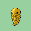

# No.0014 铁壳蛹

虫
毒

## 种族值

HP45<i style="width:17.6%"></i>

攻击25<i style="width:9.8%"></i>

防御50<i style="width:19.6%"></i>

特攻25<i style="width:9.8%"></i>

特防25<i style="width:9.8%"></i>

速度35<i style="width:13.7%"></i>

总和205

## 特性

| | 名称 |
|---|---|
| 特性1 | 蜕皮 |
| 特性2 | 蜕皮 |
| 隐藏特性 | 蜕皮 |

## 进化

| 条件 | 进化后 |
|---|---|
| 升到 10 级 | [大针蜂](0015_大针蜂.md) |

## 其他数据

| 项目 | 数值 |
|---|---|
| 捕获率 | 120 |
| 基础经验 | 71 |
| 击败获得努力值 | 防御+2 |
| 性别比例 | ♂ 50.0% / ♀ 50.0% |
| 蛋群 | 虫 |
| 孵化周期 | 15 |
| 初始亲密度 | 50 |
| 升级速度 | 较快 |
