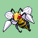

# No.0015 大针蜂

虫
毒

## 种族值

HP65<i style="width:25.5%"></i>

攻击90<i style="width:35.3%"></i>

防御40<i style="width:15.7%"></i>

特攻45<i style="width:17.6%"></i>

特防80<i style="width:31.4%"></i>

速度75<i style="width:29.4%"></i>

总和395

## 特性

| | 名称 |
|---|---|
| 特性1 | 虫之预感 |
| 特性2 | 狙击手 |
| 隐藏特性 | 技师 |

## 进化

| 条件 | 进化后 |
|---|---|
| 超级进化 | [大针蜂](0873_大针蜂.md) |

## 其他数据

| 项目 | 数值 |
|---|---|
| 捕获率 | 45 |
| 基础经验 | 159 |
| 击败获得努力值 | 攻击+2、特防+1 |
| 性别比例 | ♂ 50.0% / ♀ 50.0% |
| 蛋群 | 虫 |
| 孵化周期 | 15 |
| 初始亲密度 | 50 |
| 升级速度 | 较快 |
| 野生携带 | 毒针 |
