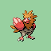

# No.0021 烈雀

一般
飞行

## 种族值

HP40<i style="width:15.7%"></i>

攻击60<i style="width:23.5%"></i>

防御30<i style="width:11.8%"></i>

特攻31<i style="width:12.2%"></i>

特防31<i style="width:12.2%"></i>

速度70<i style="width:27.5%"></i>

总和262

## 特性

| | 名称 |
|---|---|
| 特性1 | 锐利目光 |
| 特性2 | 狙击手 |
| 隐藏特性 | 不仁不义 |

## 进化

| 条件 | 进化后 |
|---|---|
| 升到 20 级 | [大嘴雀](0022_大嘴雀.md) |

## 其他数据

| 项目 | 数值 |
|---|---|
| 捕获率 | 255 |
| 基础经验 | 58 |
| 击败获得努力值 | 速度+1 |
| 性别比例 | ♂ 50.0% / ♀ 50.0% |
| 蛋群 | 飞行 |
| 孵化周期 | 15 |
| 初始亲密度 | 50 |
| 升级速度 | 较快 |
| 野生携带 | 锐利鸟嘴 |
