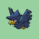

# No.0198 黑暗鸦

恶
飞行

## 种族值

HP60<i style="width:23.5%"></i>

攻击85<i style="width:33.3%"></i>

防御42<i style="width:16.5%"></i>

特攻85<i style="width:33.3%"></i>

特防42<i style="width:16.5%"></i>

速度91<i style="width:35.7%"></i>

总和405

## 特性

| | 名称 |
|---|---|
| 特性1 | 不眠 |
| 特性2 | 超幸运 |
| 隐藏特性 | 恶作剧之心 |

## 进化

| 条件 | 进化后 |
|---|---|
| 使用 暗之石 | [乌鸦头头](0483_乌鸦头头.md) |

## 其他数据

| 项目 | 数值 |
|---|---|
| 捕获率 | 30 |
| 基础经验 | 107 |
| 击败获得努力值 | 速度+1 |
| 性别比例 | ♂ 50.0% / ♀ 50.0% |
| 蛋群 | 飞行 |
| 孵化周期 | 20 |
| 初始亲密度 | 35 |
| 升级速度 | 较慢 |
