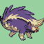

# No.0488 坦克臭鼬

毒
恶

## 种族值

HP103<i style="width:40.4%"></i>

攻击93<i style="width:36.5%"></i>

防御67<i style="width:26.3%"></i>

特攻71<i style="width:27.8%"></i>

特防61<i style="width:23.9%"></i>

速度84<i style="width:32.9%"></i>

总和479

## 特性

| | 名称 |
|---|---|
| 特性1 | 恶臭 |
| 特性2 | 引爆 |
| 隐藏特性 | 毒手 |

## 其他数据

| 项目 | 数值 |
|---|---|
| 捕获率 | 60 |
| 基础经验 | 209 |
| 击败获得努力值 | HP+2 |
| 性别比例 | ♂ 50.0% / ♀ 50.0% |
| 蛋群 | 陆上 |
| 孵化周期 | 20 |
| 初始亲密度 | 50 |
| 升级速度 | 较快 |
| 野生携带 | 桃桃果 |
