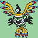

# No.0614 象征鸟

超能力
飞行

## 种族值

HP72<i style="width:28.2%"></i>

攻击58<i style="width:22.7%"></i>

防御80<i style="width:31.4%"></i>

特攻103<i style="width:40.4%"></i>

特防80<i style="width:31.4%"></i>

速度97<i style="width:38.0%"></i>

总和490

## 特性

| | 名称 |
|---|---|
| 特性1 | 奇迹皮肤 |
| 特性2 | 魔法防守 |
| 隐藏特性 | 有色眼镜 |

## 其他数据

| 项目 | 数值 |
|---|---|
| 捕获率 | 45 |
| 基础经验 | 172 |
| 击败获得努力值 | 特攻+2 |
| 性别比例 | ♂ 50.0% / ♀ 50.0% |
| 蛋群 | 飞行 |
| 孵化周期 | 20 |
| 初始亲密度 | 50 |
| 升级速度 | 较快 |
