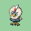

# No.0680 毛头小鹰

一般
飞行

## 种族值

HP70<i style="width:27.5%"></i>

攻击83<i style="width:32.5%"></i>

防御50<i style="width:19.6%"></i>

特攻37<i style="width:14.5%"></i>

特防50<i style="width:19.6%"></i>

速度60<i style="width:23.5%"></i>

总和350

## 特性

| | 名称 |
|---|---|
| 特性1 | 锐利目光 |
| 特性2 | 全力攻击 |
| 隐藏特性 | 活力 |

## 进化

| 条件 | 进化后 |
|---|---|
| 升到 50 级 | [勇士雄鹰](0681_勇士雄鹰.md) |
| 携带 王者之证 升到 50 级 | [勇士雄鹰](1246_勇士雄鹰.md) |
| 在特定地图升级 | [勇士雄鹰](1246_勇士雄鹰.md) |

## 其他数据

| 项目 | 数值 |
|---|---|
| 捕获率 | 190 |
| 基础经验 | 70 |
| 击败获得努力值 | 攻击+1 |
| 性别比例 | ♂ 100.0% / ♀ 0.0% |
| 蛋群 | 飞行 |
| 孵化周期 | 20 |
| 初始亲密度 | 50 |
| 升级速度 | 慢 |
