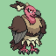

# No.0683 秃鹰娜

恶
飞行

## 种族值

HP110<i style="width:43.1%"></i>

攻击65<i style="width:25.5%"></i>

防御105<i style="width:41.2%"></i>

特攻55<i style="width:21.6%"></i>

特防95<i style="width:37.3%"></i>

速度80<i style="width:31.4%"></i>

总和510

## 特性

| | 名称 |
|---|---|
| 特性1 | 健壮胸肌 |
| 特性2 | 防尘 |
| 隐藏特性 | 破碎铠甲 |

## 其他数据

| 项目 | 数值 |
|---|---|
| 捕获率 | 60 |
| 基础经验 | 179 |
| 击败获得努力值 | 特攻+2 |
| 性别比例 | ♂ 0.0% / ♀ 100.0% |
| 蛋群 | 飞行 |
| 孵化周期 | 20 |
| 初始亲密度 | 35 |
| 升级速度 | 慢 |
