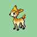

# No.0739 四季鹿

一般
草

## 种族值

HP60<i style="width:23.5%"></i>

攻击60<i style="width:23.5%"></i>

防御50<i style="width:19.6%"></i>

特攻40<i style="width:15.7%"></i>

特防50<i style="width:19.6%"></i>

速度75<i style="width:29.4%"></i>

总和335

## 特性

| | 名称 |
|---|---|
| 特性1 | 叶绿素 |
| 特性2 | 食草 |
| 隐藏特性 | 天恩 |

## 进化

| 条件 | 进化后 |
|---|---|
| 升到 34 级 | [萌芽鹿](0742_萌芽鹿.md) |

## 其他数据

| 项目 | 数值 |
|---|---|
| 捕获率 | 190 |
| 基础经验 | 67 |
| 击败获得努力值 | 速度+1 |
| 性别比例 | ♂ 50.0% / ♀ 50.0% |
| 蛋群 | 陆上 |
| 孵化周期 | 20 |
| 初始亲密度 | 50 |
| 升级速度 | 较快 |
