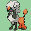

# No.0860 多丽米亚

一般

## 种族值

HP75<i style="width:29.4%"></i>

攻击80<i style="width:31.4%"></i>

防御60<i style="width:23.5%"></i>

特攻65<i style="width:25.5%"></i>

特防90<i style="width:35.3%"></i>

速度102<i style="width:40.0%"></i>

总和472

## 特性

| | 名称 |
|---|---|
| 特性1 | 毛皮大衣 |

## 其他数据

| 项目 | 数值 |
|---|---|
| 捕获率 | 160 |
| 基础经验 | 165 |
| 击败获得努力值 | 速度+1 |
| 性别比例 | ♂ 50.0% / ♀ 50.0% |
| 蛋群 | 陆上 |
| 孵化周期 | 20 |
| 初始亲密度 | 50 |
| 升级速度 | 较快 |
