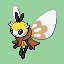

# No.0960 蝶结萌虻

虫
妖精

## 种族值

HP60<i style="width:23.5%"></i>

攻击55<i style="width:21.6%"></i>

防御60<i style="width:23.5%"></i>

特攻95<i style="width:37.3%"></i>

特防70<i style="width:27.5%"></i>

速度124<i style="width:48.6%"></i>

总和464

## 特性

| | 名称 |
|---|---|
| 特性1 | 采蜜 |
| 特性2 | 鳞粉 |
| 隐藏特性 | 甜幕 |

## 其他数据

| 项目 | 数值 |
|---|---|
| 捕获率 | 75 |
| 基础经验 | 138 |
| 击败获得努力值 | 速度+2 |
| 性别比例 | ♂ 50.0% / ♀ 50.0% |
| 蛋群 | 虫 / 妖精 |
| 孵化周期 | 20 |
| 初始亲密度 | 50 |
| 升级速度 | 较快 |
| 野生携带 | 甜甜蜜 |
