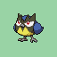

# No.1113 稚山雀

飞行

## 种族值

HP38<i style="width:14.9%"></i>

攻击47<i style="width:18.4%"></i>

防御35<i style="width:13.7%"></i>

特攻33<i style="width:12.9%"></i>

特防35<i style="width:13.7%"></i>

速度57<i style="width:22.4%"></i>

总和245

## 特性

| | 名称 |
|---|---|
| 特性1 | 锐利目光 |
| 特性2 | 紧张感 |
| 隐藏特性 | 健壮胸肌 |

## 进化

| 条件 | 进化后 |
|---|---|
| 升到 18 级 | [蓝鸦](1114_蓝鸦.md) |

## 其他数据

| 项目 | 数值 |
|---|---|
| 捕获率 | 255 |
| 基础经验 | 49 |
| 击败获得努力值 | 速度+1 |
| 性别比例 | ♂ 50.0% / ♀ 50.0% |
| 蛋群 | 飞行 |
| 孵化周期 | 15 |
| 初始亲密度 | 50 |
| 升级速度 | 较慢 |
