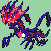

# No.1182 无极汰那

毒
龙

## 种族值

HP140<i style="width:54.9%"></i>

攻击85<i style="width:33.3%"></i>

防御95<i style="width:37.3%"></i>

特攻145<i style="width:56.9%"></i>

特防95<i style="width:37.3%"></i>

速度130<i style="width:51.0%"></i>

总和690

## 特性

| | 名称 |
|---|---|
| 特性1 | 压迫感 |

## 其他数据

| 项目 | 数值 |
|---|---|
| 捕获率 | 255 |
| 基础经验 | 255 |
| 击败获得努力值 | HP+3 |
| 性别比例 | 无性别 |
| 蛋群 | 未发现 |
| 孵化周期 | 120 |
| 初始亲密度 | 0 |
| 升级速度 | 慢 |
