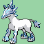

# No.1188 雪暴马

冰

## 种族值

HP100<i style="width:39.2%"></i>

攻击145<i style="width:56.9%"></i>

防御130<i style="width:51.0%"></i>

特攻65<i style="width:25.5%"></i>

特防110<i style="width:43.1%"></i>

速度30<i style="width:11.8%"></i>

总和580

## 特性

| | 名称 |
|---|---|
| 特性1 | 自信过度 |

## 其他数据

| 项目 | 数值 |
|---|---|
| 捕获率 | 3 |
| 基础经验 | 255 |
| 击败获得努力值 | 攻击+3 |
| 性别比例 | 无性别 |
| 蛋群 | 未发现 |
| 孵化周期 | 120 |
| 初始亲密度 | 35 |
| 升级速度 | 慢 |
