# 支线任务

从皮丘的旅途，到被解开的封印。

<strong>96</strong> 项任务<strong>118</strong> 种道具<strong>15</strong> 种宝可梦<strong>8</strong> 种 Mega 波动<strong>16</strong> 项其他解锁

任务001–096 · 对白与奖励快照：2026-10-04。分支奖励分别列出，不作累计。

<nav class="sq-tabs" aria-label="支线任务导航"><a href="./" aria-current="page">任务目录</a><a href="rewards/">奖励反查</a></nav>

**266 个剧情阶段 · 332 页游戏见闻录**，已同步阶段条件与补齐对白。

[阶段总表](stages.md) · [涉及地图](maps.md) · [下载修订台本（Word）](downloads/sidequest-scriptbook-20261004.docx)

<form class="sq-controls" role="search">
<label class="sq-search">搜索任务<input type="search" name="q" autocomplete="off" placeholder="编号、任务名、奖励、Mega 波动…"></label>
<label>奖励类型<select name="kind"><option value="all">全部奖励</option><option value="pokemon">宝可梦与蛋</option><option value="item">道具</option><option value="mega">Mega 波动</option><option value="unlock">功能与服装解锁</option><option value="money">金钱</option><option value="BP">BracerPoints 点数</option></select></label>
</form>

共 96 项任务

<article class="sq-row" data-sq-entry data-kind="BP pokemon" data-search="001 任务001 皮丘的旅途 带着皮丘去桐树林看看吧. BracerPoints 6点 完成奖励 刺刺耳皮丘 Lv.5（携带：无） 完成奖励 赠送的是刺刺耳皮丘（物种槽1100），不是普通皮丘。岩铁身份已按用户确认。 若叶镇 3.66 若叶镇 3.66 若叶镇 3.66 若叶镇 3.66 若叶镇 3.66 若叶镇 3.66 吉野市 3.67 桐树林 1.121 桐树林 1.121 彩虹百货大楼 0.0 点数 积分 BP BracerPoints">
001

<a class="sq-title" href="001/">皮丘的旅途</a>
带着皮丘去桐树林看看吧.

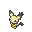刺刺耳皮丘 Lv.5（携带：无）

BracerPoints宝可梦

</article>
<article class="sq-row" data-sq-entry data-kind="BP mega money" data-search="002 任务002 向往天空的理由 帮助阿速寻找向往天空的理由. BracerPoints 10点 完成奖励 金钱12000元 完成奖励 大比鸟超级进化波动 完成奖励 额外获得大比鸟超级进化波动；普通塔内长老赠送的TM70未算入本支线。 喇叭芽之塔 52.2 桔梗市 46.7 喇叭芽之塔 1.90 喇叭芽之塔 52.2 点数 积分 BP BracerPoints Mega 超级进化 波动">
002

<a class="sq-title" href="002/">向往天空的理由</a>
帮助阿速寻找向往天空的理由.

大比鸟超级进化波动

BracerPointsMega 波动金钱

</article>
<article class="sq-row" data-sq-entry data-kind="BP item mega money" data-search="003 任务003 钢铁与黑曜 去桐树林寻找阿笔,协助他完成有关虫宝可梦的研究. 黑奇石×1 森林战斗后获得 金属膜×1 森林结尾奖励（源码） BracerPoints 10点 森林结尾奖励（源码） 金钱12000元 森林结尾奖励（源码） 巨钳螳螂超级进化波动（源码已定义，触发待核） 森林结尾奖励（源码，触发待核） 森林后续已补入台本，任务表接取/完成标志已修正为0xB9A→0xB9E。森林结尾发放黑奇石、金属膜、10BP、12000元，并解锁巨钳螳螂超级进化波动。 桧皮镇 47.0 桐树林 1.121 桐树林 1.121 满金市 3.75 满金市 3.75 满金市 3.75 满金市 3.75 桧皮镇 47.0 点数 积分 BP BracerPoints Mega 超级进化 波动">
003

<a class="sq-title" href="003/">钢铁与黑曜</a>
去桐树林寻找阿笔,协助他完成有关虫宝可梦的研究.

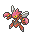巨钳螳螂超级进化波动（源码已定义，触发待核）
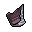黑奇石×1
金属膜×1

BracerPoints道具Mega 波动金钱

</article>
<article class="sq-row" data-sq-entry data-kind="BP item mega money" data-search="004 任务004 霓虹灯外的月光 帮助小茜与皮可西学会接纳自己. 月之石×1 完成奖励 BracerPoints 10点 完成奖励 金钱12000元 完成奖励 皮可西超级进化波动 完成奖励 额外解锁皮可西超级进化波动。 自然公园 55.59 满金市 50.28 满金市 50.19 点数 积分 BP BracerPoints Mega 超级进化 波动">
004

<a class="sq-title" href="004/">霓虹灯外的月光</a>
帮助小茜与皮可西学会接纳自己.

皮可西超级进化波动
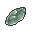月之石×1

BracerPoints道具Mega 波动金钱

</article>
<article class="sq-row" data-sq-entry data-kind="BP mega money" data-search="005 任务005 无法冻结的时间 和柳伯一起去冰天地看看无法融化的冰壁. BracerPoints 10点 完成奖励 金钱12000元 完成奖励 雪妖女超级进化波动 完成奖励 额外解锁雪妖女超级进化波动。小拉普拉斯由柳伯留下，脚本没有把它作为玩家赠礼。 擂钵山 55.13 真新镇 52.25 冰天地 53.17 满金市 3.75 冰天地 53.7 擂钵山 55.13 点数 积分 BP BracerPoints Mega 超级进化 波动">
005

<a class="sq-title" href="005/">无法冻结的时间</a>
和柳伯一起去冰天地看看无法融化的冰壁.

雪妖女超级进化波动

BracerPointsMega 波动金钱

</article>
<article class="sq-row" data-sq-entry data-kind="" data-search="006 任务006 水与火的修罗场 寻找调和火球鼠与水水獭之间冲突的木木枭. 本阶段未见独立道具、金钱、宝可梦或点数发放；洗翠篇统一结算见任务011。 擂钵山 42.0 擂钵山 42.0">
006

<a class="sq-title" href="006/">水与火的修罗场</a>
寻找调和火球鼠与水水獭之间冲突的木木枭.

奖励待核对

</article>
<article class="sq-row" data-sq-entry data-kind="" data-search="007 任务007 山顶的秘密 追上逃向擂钵山山顶的三只宝可梦. 本阶段未见独立发奖指令；洗翠篇统一结算见任务011。 擂钵山 42.0 擂钵山 56.42 擂钵山 56.42 擂钵山 56.42 擂钵山 42.0">
007

<a class="sq-title" href="007/">山顶的秘密</a>
追上逃向擂钵山山顶的三只宝可梦.

奖励待核对

</article>
<article class="sq-row" data-sq-entry data-kind="" data-search="008 任务008 冻土上的捉迷藏 在纯白冻土里找回失散的三只宝可梦. 本阶段未见独立发奖指令；洗翠篇统一结算见任务011。 纯白冻土 52.23 纯白冻土 52.23 纯白冻土 52.24 擂钵山 56.42">
008

<a class="sq-title" href="008/">冻土上的捉迷藏</a>
在纯白冻土里找回失散的三只宝可梦.

奖励待核对

</article>
<article class="sq-row" data-sq-entry data-kind="" data-search="009 任务009 纯白的魅影 寻找木木枭时,遭遇了洗翠索罗亚克的幻影.小心它的速度,准备迎战! 本阶段未见独立发奖指令；洗翠篇统一结算见任务011。 纯白冻土 52.24 纯白冻土 52.24 擂钵山 56.42">
009

<a class="sq-title" href="009/">纯白的魅影</a>
寻找木木枭时,遭遇了洗翠索罗亚克的幻影.小心它的速度,准备迎战!

奖励待核对

</article>
<article class="sq-row" data-sq-entry data-kind="" data-search="010 任务010 在未知的土地上 结识拉苯博士,倾听他的梦想,见证这段羁绊的开端与落幕. 回到现代后的道具、15BP和20000元归任务011统一结算，本章不重复累计。 纯白冻土 52.24 纯白冻土 52.24 纯白冻土 52.24 擂钵山 56.42">
010

<a class="sq-title" href="010/">在未知的土地上</a>
结识拉苯博士,倾听他的梦想,见证这段羁绊的开端与落幕.

奖励待核对

</article>
<article class="sq-row" data-sq-entry data-kind="BP item money" data-search="011 任务011 来自未来的回响 所有的生命与其他的生命相遇,一定会孕育出什么吧. 精灵球模具×1 完成奖励 森之羊羹×5 完成奖励 护符金币×1 完成奖励 BracerPoints 15点 完成奖励 金钱20000元 完成奖励 道具名称取当前ROM：源码注释曾称卷轴，但实际编号对应精灵球模具、森之羊羹、护符金币。 擂钵山 42.0 擂钵山 42.0 点数 积分 BP BracerPoints">
011

<a class="sq-title" href="011/">来自未来的回响</a>
所有的生命与其他的生命相遇,一定会孕育出什么吧.

精灵球模具×1
森之羊羹×5
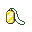护符金币×1

BracerPoints道具金钱

</article>
<article class="sq-row" data-sq-entry data-kind="BP item money" data-search="012 任务012 少女的烦恼 帮助若叶镇的大牙狸少女寻找不变之石. 经验糖果S×2 完成奖励 TM110×1 完成奖励 金钱5000元 完成奖励 BracerPoints 3点 完成奖励 若叶镇 3.66 若叶镇 3.66 若叶镇 3.66 点数 积分 BP BracerPoints">
012

<a class="sq-title" href="012/">少女的烦恼</a>
帮助若叶镇的大牙狸少女寻找不变之石.

经验糖果S×2
TM110×1

BracerPoints道具金钱

</article>
<article class="sq-row" data-sq-entry data-kind="BP item money pokemon" data-search="013 任务013 进化之谜 帮助若叶镇的女孩探究有关皮皮的进化之谜. 月之石×1 完成奖励 金钱4000元 完成奖励 BracerPoints 4点 完成奖励 皮皮 Lv.5（携带：苹野果） 接取时赠送 若叶镇 43.4 若叶镇 43.4 点数 积分 BP BracerPoints">
013

<a class="sq-title" href="013/">进化之谜</a>
帮助若叶镇的女孩探究有关皮皮的进化之谜.

月之石×1
皮皮 Lv.5（携带：苹野果）

BracerPoints道具金钱宝可梦

</article>
<article class="sq-row" data-sq-entry data-kind="BP item" data-search="014 任务014 红色火球之谜 帮助29号道路的男子捉住红色的火球. 金珠×2 完成奖励 BracerPoints 3点 完成奖励 29号道路 3.79 29号道路 3.79 点数 积分 BP BracerPoints">
014

<a class="sq-title" href="014/">红色火球之谜</a>
帮助29号道路的男子捉住红色的火球.

金珠×2

BracerPoints道具

</article>
<article class="sq-row" data-sq-entry data-kind="BP item money" data-search="015 任务015 小猫怪的耳朵 给29号道路的短裤少年看一看小猫怪的耳朵. 橙橙果×5 完成奖励 金钱3000元 完成奖励 BracerPoints 3点 完成奖励 29号道路 3.79 29号道路 3.79 点数 积分 BP BracerPoints">
015

<a class="sq-title" href="015/">小猫怪的耳朵</a>
给29号道路的短裤少年看一看小猫怪的耳朵.

橙橙果×5

BracerPoints道具金钱

</article>
<article class="sq-row" data-sq-entry data-kind="BP item" data-search="016 任务016 口渴的大叔 帮助口渴的大叔收集30瓶树果汁. 金珠×3 完成奖励 BracerPoints 6点 完成奖励 树果×1（种类由脚本变量决定） 后续：每日树果（不同入口，非累计） 每日树果属于后续服务，树果编号由变量决定，不能把变量32781当成固定道具。 31号道路 45.5 31号道路 45.5 点数 积分 BP BracerPoints">
016

<a class="sq-title" href="016/">口渴的大叔</a>
帮助口渴的大叔收集30瓶树果汁.

金珠×3
树果×1（种类由脚本变量决定）

BracerPoints道具

</article>
<article class="sq-row" data-sq-entry data-kind="item unlock" data-search="017 任务017 精灵爷爷的实验 使用精灵爷爷的新发明让鬼斯通进化吧. 通信电缆×1 接取时交付（用于实验） 通信电缆×3 完成奖励 精灵爷爷的电话号码 剧情登记电话时 原对白提示3BP，但已关联的结算脚本未发现对应0x5135加点指令；台本保留“提示3BP，实际加点待核”，不能写成已确认到账。 31号道路 45.6 31号道路 45.6 解锁">
017

<a class="sq-title" href="017/">精灵爷爷的实验</a>
使用精灵爷爷的新发明让鬼斯通进化吧.

精灵爷爷的电话号码
通信电缆×1
通信电缆×3

道具功能与服装解锁

</article>
<article class="sq-row" data-sq-entry data-kind="" data-search="018 任务018 希鲁夫的遗产 替精灵爷爷去黑暗穴交接一件物品. 这一阶段确认的是U盘交接和修复剧情，未见独立金钱／BP发放；多边兽与12000元、10BP在任务019结算。 31号道路 45.6 黑暗洞穴 1.126 31号道路 45.6">
018

<a class="sq-title" href="018/">希鲁夫的遗产</a>
替精灵爷爷去黑暗穴交接一件物品.

奖励待核对

</article>
<article class="sq-row" data-sq-entry data-kind="BP item money pokemon" data-search="019 任务019 连接未来的牵绊 协助精灵爷爷,击退希鲁夫研究员.见证多边兽的奇迹进化. 多边兽零式 Lv.30（携带：升级数据） 完成奖励 金钱12000元 完成奖励 BracerPoints 10点 完成奖励 ROM物种名为“多边兽零式”，原对白称“多边兽零型”，同一物种槽275；名称差异保留。 31号道路 45.6 30号道路 56.76 31号道路 45.6 点数 积分 BP BracerPoints">
019

<a class="sq-title" href="019/">连接未来的牵绊</a>
协助精灵爷爷,击退希鲁夫研究员.见证多边兽的奇迹进化.

多边兽零式 Lv.30（携带：升级数据）

BracerPoints道具金钱宝可梦

</article>
<article class="sq-row" data-sq-entry data-kind="BP item unlock" data-search="020 任务020 收集研究所物资 帮助空木博士的妻子收集研究所需要的物资. 经验糖果XS×2 完成奖励 超级球×5 完成奖励 BracerPoints 4点 完成奖励 博士妻子的电话号码 剧情登记电话时 若叶镇 43.5 若叶镇 43.5 点数 积分 BP BracerPoints 解锁">
020

<a class="sq-title" href="020/">收集研究所物资</a>
帮助空木博士的妻子收集研究所需要的物资.

博士妻子的电话号码
经验糖果XS×2
超级球×5

BracerPoints道具功能与服装解锁

</article>
<article class="sq-row" data-sq-entry data-kind="BP item money" data-search="021 任务021 要进化的绿毛虫 帮助吉野市的女孩收服一只绿毛虫. 经验糖果XS×2 完成奖励 BracerPoints 3点 完成奖励 金钱5000元 完成奖励 吉野市 45.4 吉野市 45.4 点数 积分 BP BracerPoints">
021

<a class="sq-title" href="021/">要进化的绿毛虫</a>
帮助吉野市的女孩收服一只绿毛虫.

经验糖果XS×2

BracerPoints道具金钱

</article>
<article class="sq-row" data-sq-entry data-kind="BP item" data-search="022 任务022 制服狂暴宝可梦 制服在黑暗洞穴南部的狂暴的宝可梦. BracerPoints 5点 完成奖励 红色碎片×2 完成奖励 黄色碎片×2 完成奖励 TM100×1 完成奖励 协会每日10BP属于日常领取，未叠入本任务5BP。 对战开拓区 4.125 石英高原 4.140 吉野市 45.0 桔梗市 46.0 黑暗洞穴 1.125 吉野市 45.0 点数 积分 BP BracerPoints">
022

<a class="sq-title" href="022/">制服狂暴宝可梦</a>
制服在黑暗洞穴南部的狂暴的宝可梦.

红色碎片×2
黄色碎片×2
TM100×1

BracerPoints道具

</article>
<article class="sq-row" data-sq-entry data-kind="BP item money" data-search="023 任务023 红色碎片告急 帮助独自旅行的杂耍艺人收集红色碎片. 樱子果×3 完成奖励 桃桃果×3 完成奖励 苹野果×3 完成奖励 金钱4000元 完成奖励 BracerPoints 3点 完成奖励 桔梗市 3.68 桔梗市 3.68 点数 积分 BP BracerPoints">
023

<a class="sq-title" href="023/">红色碎片告急</a>
帮助独自旅行的杂耍艺人收集红色碎片.

樱子果×3
桃桃果×3
苹野果×3

BracerPoints道具金钱

</article>
<article class="sq-row" data-sq-entry data-kind="BP item" data-search="024 任务024 复习宝可梦知识 与训练家学校的学生一起复习关于宝可梦的知识. 博识眼镜×1 完成奖励 BracerPoints 3点 答题点数（按答对题数，四档互斥） BracerPoints 4点 答题点数（按答对题数，四档互斥） BracerPoints 5点 答题点数（按答对题数，四档互斥） BracerPoints 6点 答题点数（按答对题数，四档互斥） 每答对一题加1分，结算以3为基础：答对0／1／2／3题分别获得3／4／5／6BP，四档互斥。 桔梗市 46.7 桔梗市 46.9 桔梗市 46.7 点数 积分 BP BracerPoints">
024

<a class="sq-title" href="024/">复习宝可梦知识</a>
与训练家学校的学生一起复习关于宝可梦的知识.

博识眼镜×1

BracerPoints道具

</article>
<article class="sq-row" data-sq-entry data-kind="BP item money unlock" data-search="025 任务025 修行的难题 帮助喇叭芽之塔的僧侣捕捉一只喇叭芽. 大根茎×1 完成奖励 金钱4000元 完成奖励 BracerPoints 3点 完成奖励 经验糖果XS×2 完成奖励 僧侣勿念的电话号码 同意交换电话后 喇叭芽之塔 1.88 喇叭芽之塔 1.88 点数 积分 BP BracerPoints 解锁">
025

<a class="sq-title" href="025/">修行的难题</a>
帮助喇叭芽之塔的僧侣捕捉一只喇叭芽.

僧侣勿念的电话号码
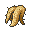大根茎×1
经验糖果XS×2

BracerPoints道具金钱功能与服装解锁

</article>
<article class="sq-row" data-sq-entry data-kind="BP item money" data-search="026 任务026 痛苦的大食花 前往桔梗市树海的深处将大食花丛痛苦中解救出来. 经验糖果S×1 完成奖励 BracerPoints 8点 完成奖励 金钱10000元 完成奖励 光之黏土×1 完成奖励 喇叭芽之塔 1.88 喇叭芽之塔 1.88 点数 积分 BP BracerPoints">
026

<a class="sq-title" href="026/">痛苦的大食花</a>
前往桔梗市树海的深处将大食花丛痛苦中解救出来.

经验糖果S×1
光之黏土×1

BracerPoints道具金钱

</article>
<article class="sq-row" data-sq-entry data-kind="BP item money" data-search="027 任务027 喇叭芽塔的妖怪 去查清关于喇叭芽之塔的妖怪的真相吧! 红色碎片×2 完成奖励 经验糖果XS×2 完成奖励 金钱4000元 完成奖励 BracerPoints 3点 完成奖励 桔梗市 3.68 桔梗市 3.68 点数 积分 BP BracerPoints">
027

<a class="sq-title" href="027/">喇叭芽塔的妖怪</a>
去查清关于喇叭芽之塔的妖怪的真相吧!

红色碎片×2
经验糖果XS×2

BracerPoints道具金钱

</article>
<article class="sq-row" data-sq-entry data-kind="BP item money" data-search="028 任务028 可爱的姆克儿 捕捉一只姆克儿,并把它给桔梗市的小女孩摸一摸吧. 肌力之羽×10 完成奖励 经验糖果XS×3 完成奖励 金钱3000元 完成奖励 BracerPoints 2点 完成奖励 桔梗市 46.2 桔梗市 46.2 点数 积分 BP BracerPoints">
028

<a class="sq-title" href="028/">可爱的姆克儿</a>
捕捉一只姆克儿,并把它给桔梗市的小女孩摸一摸吧.

肌力之羽×10
经验糖果XS×3

BracerPoints道具金钱

</article>
<article class="sq-row" data-sq-entry data-kind="BP item" data-search="029 任务029 帅与可爱的精灵 寻找既是钢系,又是妖精系,兼具帅气与可爱的宝可梦. TM113×1 完成奖励 BracerPoints 5点 完成奖励 桔梗市 46.9 桔梗市 46.9 桔梗市 46.9 桔梗市 46.9 桔梗市 46.9 桔梗市 46.9 点数 积分 BP BracerPoints">
029

<a class="sq-title" href="029/">帅与可爱的精灵</a>
寻找既是钢系,又是妖精系,兼具帅气与可爱的宝可梦.

TM113×1

BracerPoints道具

</article>
<article class="sq-row" data-sq-entry data-kind="BP item" data-search="030 任务030 七大不可思议 探究训练家学校七大不可思议的真相. 电气球×1 完成奖励 BracerPoints 8点 完成奖励 桔梗市 46.7 桔梗市 56.7 桔梗市 56.0 桔梗市 56.0 桔梗市 56.0 桔梗市 56.2 桔梗市 56.3 桔梗市 56.3 桔梗市 56.4 桔梗市 56.5 桔梗市 56.5 桔梗市 56.5 桔梗市 56.5 桔梗市 56.6 桔梗市 56.6 桔梗市 56.7 桔梗市 46.7 点数 积分 BP BracerPoints">
030

<a class="sq-title" href="030/">七大不可思议</a>
探究训练家学校七大不可思议的真相.

电气球×1

BracerPoints道具

</article>
<article class="sq-row" data-sq-entry data-kind="BP item money unlock" data-search="031 任务031 阿始的新节目 帮助阿始录制新的电视教学节目. 金钱6000元 完成奖励 气势披带×1 完成奖励 BracerPoints 3点 完成奖励 阿始的电话号码 剧情登记电话时 Lv.1小拉达及其携带气势披带是拍摄用临时队伍；完成奖励另发气势披带×1，不永久赠送小拉达。 桔梗市 46.0 真新镇 56.8 桔梗市 46.0 点数 积分 BP BracerPoints 解锁">
031

<a class="sq-title" href="031/">阿始的新节目</a>
帮助阿始录制新的电视教学节目.

阿始的电话号码
气势披带×1

BracerPoints道具金钱功能与服装解锁

</article>
<article class="sq-row" data-sq-entry data-kind="BP item money" data-search="032 任务032 阿始的极限秀 帮助阿始录制新的极限秀节目. 金钱6000元 完成奖励 剧毒宝珠×1 完成奖励 BracerPoints 8点 完成奖励 Lv.30圈圈熊是临时拍摄队伍；剧毒宝珠×1是独立结算赠礼。 桔梗市 46.0 真新镇 52.16 桔梗市 46.0 点数 积分 BP BracerPoints">
032

<a class="sq-title" href="032/">阿始的极限秀</a>
帮助阿始录制新的极限秀节目.

剧毒宝珠×1

BracerPoints道具金钱

</article>
<article class="sq-row" data-sq-entry data-kind="BP item money unlock" data-search="033 任务033 最后的大哥秀 帮助阿始进行最后的巡回路演. 教学电视×1 完成奖励 金钱12000元 完成奖励 BracerPoints 10点 完成奖励 金色王冠×1 完成奖励 极限特训服务（王冠为使用费用） 完成后开放；50级以上宝可梦，使用金色或银色王冠 Lv.30暴鲤龙、长耳兔为临时演出队伍，未计入永久赠礼。后续开放极限特训。 桔梗市 46.0 真新镇 52.20 桔梗市 46.0 点数 积分 BP BracerPoints 解锁">
033

<a class="sq-title" href="033/">最后的大哥秀</a>
帮助阿始进行最后的巡回路演.

极限特训服务（王冠为使用费用）
教学电视×1
金色王冠×1

BracerPoints道具金钱功能与服装解锁

</article>
<article class="sq-row" data-sq-entry data-kind="BP item money" data-search="034 任务034 阿露福遗迹之谜 解开有关阿露福遗迹的真相! 未知图腾笔记×1 接取时获得（两入口同一份） 秘密琥珀×1 完成奖励 贝壳化石×1 完成奖励 甲壳化石×1 完成奖励 BracerPoints 15点 完成奖励 金钱15000元 完成奖励 两个加入研究所入口各写同一份未知图腾笔记，汇总仅算一份。 阿露福遗迹 56.9 阿露福遗迹 1.50 阿露福遗迹 1.50 阿露福遗迹 56.9 点数 积分 BP BracerPoints">
034

<a class="sq-title" href="034/">阿露福遗迹之谜</a>
解开有关阿露福遗迹的真相!

未知图腾笔记×1
秘密琥珀×1
贝壳化石×1
另有 1 项获得内容

BracerPoints道具金钱

</article>
<article class="sq-row" data-sq-entry data-kind="BP item money unlock" data-search="035 任务035 沉睡的潜能 帮助阿露福遗迹的超能力者收集所有形态的未知图腾,探究宝可梦沉睡的潜能. TM10×1 完成奖励 BracerPoints 8点 完成奖励 金钱9000元 完成奖励 觉醒力量属性查看与修改（心之鳞片为修改费用） 完成后开放；修改属性需要心之鳞片 完成后开放觉醒力量属性查看与修改；修改所需心之鳞片是费用，不是奖励。 阿露福遗迹 1.47 阿露福遗迹 1.47 点数 积分 BP BracerPoints 解锁">
035

<a class="sq-title" href="035/">沉睡的潜能</a>
帮助阿露福遗迹的超能力者收集所有形态的未知图腾,探究宝可梦沉睡的潜能.

觉醒力量属性查看与修改（心之鳞片为修改费用）
TM10×1

BracerPoints道具金钱功能与服装解锁

</article>
<article class="sq-row" data-sq-entry data-kind="BP item money" data-search="036 任务036 目标是虫系大师 帮助桧皮镇的女孩制作3个速度球. 白色香草×1 完成奖励 经验糖果XS×5 完成奖励 金钱4000元 完成奖励 BracerPoints 3点 完成奖励 桧皮镇 3.69 桧皮镇 3.69 点数 积分 BP BracerPoints">
036

<a class="sq-title" href="036/">目标是虫系大师</a>
帮助桧皮镇的女孩制作3个速度球.

白色香草×1
经验糖果XS×5

BracerPoints道具金钱

</article>
<article class="sq-row" data-sq-entry data-kind="BP item money" data-search="037 任务037 传达情书 帮助桧皮镇的青年向他在满金市的恋人传达情书. 红线×1 完成奖励 讲究眼镜×1 额外奖励：标记0x1679未设置时 BracerPoints 3点 完成奖励（与另一结算支路二选一） 金钱4000元 完成奖励（与另一结算支路二选一） 红线必发；讲究眼镜仅在标记0x1679未设置时额外发放。两条3BP／4000元结算路径互斥，不能相加。 桧皮镇 3.69 满金市 50.32 满金市 50.32 满金市 50.32 满金市 50.32 满金市 51.6 满金市 50.32 满金市 50.32 桧皮镇 3.69 点数 积分 BP BracerPoints">
037

<a class="sq-title" href="037/">传达情书</a>
帮助桧皮镇的青年向他在满金市的恋人传达情书.

红线×1
讲究眼镜×1

BracerPoints道具金钱

</article>
<article class="sq-row" data-sq-entry data-kind="BP item money" data-search="038 任务038 洞穴深处的回响 调查每周五在连接洞深处发出叫声的宝可梦. 潮湿岩石×1 完成奖励 BracerPoints 3点 完成奖励 金钱4000元 完成奖励 连接洞 3.86 连接洞 3.86 点数 积分 BP BracerPoints">
038

<a class="sq-title" href="038/">洞穴深处的回响</a>
调查每周五在连接洞深处发出叫声的宝可梦.

潮湿岩石×1

BracerPoints道具金钱

</article>
<article class="sq-row" data-sq-entry data-kind="BP item money" data-search="039 任务039 穿玩偶装的人 调查周四出现在桐树林的穿着玩偶装的人. 部位护具×1 完成奖励 BracerPoints 3点 完成奖励 金钱4000元 完成奖励 桧皮镇 44.5 桧皮镇 44.5 点数 积分 BP BracerPoints">
039

<a class="sq-title" href="039/">穿玩偶装的人</a>
调查周四出现在桐树林的穿着玩偶装的人.

部位护具×1

BracerPoints道具金钱

</article>
<article class="sq-row" data-sq-entry data-kind="BP item money" data-search="040 任务040 抱住圆木的来客 帮助碳工匠小屋的学徒,前往桐树林确认那只昏睡宝可梦的安危. TM82×1 完成奖励 经验糖果XS×4 完成奖励 BracerPoints 3点 完成奖励 金钱4000元 完成奖励 桧皮镇 47.3 桧皮镇 47.3 点数 积分 BP BracerPoints">
040

<a class="sq-title" href="040/">抱住圆木的来客</a>
帮助碳工匠小屋的学徒,前往桐树林确认那只昏睡宝可梦的安危.

TM82×1
经验糖果XS×4

BracerPoints道具金钱

</article>
<article class="sq-row" data-sq-entry data-kind="BP item mega money unlock" data-search="041 任务041 异样的呆呆兽 调查呆呆兽之井里异样的呆呆兽. 王者之证×3 完成奖励 金钱5000元 完成奖励 BracerPoints 4点 完成奖励 呆壳兽超级进化波动 完成奖励 怪兽狂袋袋的电话号码 剧情登记电话时 额外解锁呆壳兽超级进化波动。 呆呆兽之井 1.94 幻影之森 1.112 桐树林 1.121 自然公园 1.124 呆呆兽之井 1.94 寂静之丘 1.96 寂静之丘 1.96 45号道路 3.101 浅葱市 3.72 满金市 3.76 连接洞 3.94 42号道路 3.97 喇叭芽之塔 52.2 擂钵山 55.12 擂钵山 55.8 不知名遗迹 56.21 47号道路 56.25 48号道路 56.26 断崖通道 56.30 破海洞穴 56.35 呆呆兽之井 1.94 点数 积分 BP BracerPoints Mega 超级进化 波动 解锁">
041

<a class="sq-title" href="041/">异样的呆呆兽</a>
调查呆呆兽之井里异样的呆呆兽.

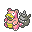呆壳兽超级进化波动
怪兽狂袋袋的电话号码
王者之证×3

BracerPoints道具Mega 波动金钱功能与服装解锁

</article>
<article class="sq-row" data-sq-entry data-kind="item unlock" data-search="042 任务042 闪耀的一等星 帮助满金市地下街的少女寻找她遗失的宝石. 红宝石×1 任务途中领取（需交回的宝石） 星星碎片×4 完成奖励 经验糖果S×2 完成奖励 爱的电话号码 剧情登记电话时 原对白提示5BP，但本轮关联脚本未发现对应加点指令；两种道具已由发放指令确认。红宝石是任务交付物。 满金市 50.7 满金市 50.11 满金市 50.7 满金市 50.7 解锁">
042

<a class="sq-title" href="042/">闪耀的一等星</a>
帮助满金市地下街的少女寻找她遗失的宝石.

爱的电话号码
红宝石×1
星星碎片×4
另有 1 项获得内容

道具功能与服装解锁

</article>
<article class="sq-row" data-sq-entry data-kind="BP item money" data-search="043 任务043 闪耀的电波 陪同地下偶像爱去广播塔参加DJ世治的广播节目. 强力香草×3 完成奖励 TM99×1 完成奖励 BracerPoints 10点 完成奖励 金钱10000元 完成奖励 满金市 50.7 真新镇 55.49 满金市 50.7 点数 积分 BP BracerPoints">
043

<a class="sq-title" href="043/">闪耀的电波</a>
陪同地下偶像爱去广播塔参加DJ世治的广播节目.

强力香草×3
TM99×1

BracerPoints道具金钱

</article>
<article class="sq-row" data-sq-entry data-kind="BP item money unlock" data-search="044 任务044 闪耀的暗影 帮助地下偶像爱调查偷偷潜入她房间的人. 经验糖果S×3 完成奖励 彗星碎片×5 完成奖励 金钱12000元 完成奖励 BracerPoints 10点 完成奖励 魔法火焰招式教学 完成后找爱学习 完成后开放魔法火焰教学。 满金市 50.7 真新镇 55.55 满金市 50.7 点数 积分 BP BracerPoints 解锁">
044

<a class="sq-title" href="044/">闪耀的暗影</a>
帮助地下偶像爱调查偷偷潜入她房间的人.

魔法火焰招式教学
经验糖果S×3
彗星碎片×5

BracerPoints道具金钱功能与服装解锁

</article>
<article class="sq-row" data-sq-entry data-kind="BP item pokemon" data-search="045 任务045 成为一般系大师 帮助满金市的少女进行对战特训. BracerPoints 5点 完成奖励 经验糖果S×1 完成奖励 向尾喵 Lv.20（携带：逃脱按键） 完成奖励 满金市 3.76 满金市 3.76 点数 积分 BP BracerPoints">
045

<a class="sq-title" href="045/">成为一般系大师</a>
帮助满金市的少女进行对战特训.

经验糖果S×1
向尾喵 Lv.20（携带：逃脱按键）

BracerPoints道具宝可梦

</article>
<article class="sq-row" data-sq-entry data-kind="BP item money unlock" data-search="046 任务046 诡异的绿光 查明公寓内出现诡异的绿光的真相. BracerPoints 3点 完成奖励 金钱4000元 完成奖励 经验糖果S×1 完成奖励 顺风招式教学 完成后展示成长后的宝可梦；非完成即自动开放 事件里的绿色超音蝠不是本轮givepokemon发放项；捕获情况另看遭遇事件。后续展示成长后的宝可梦可开放顺风教学。 满金市 56.10 满金市 56.10 满金市 56.10 点数 积分 BP BracerPoints 解锁">
046

<a class="sq-title" href="046/">诡异的绿光</a>
查明公寓内出现诡异的绿光的真相.

顺风招式教学
经验糖果S×1

BracerPoints道具金钱功能与服装解锁

</article>
<article class="sq-row" data-sq-entry data-kind="BP item money pokemon" data-search="047 任务047 家乡的味道 帮助老爷爷收集制作大马拉萨达所需的5个刺角果,5个椰木果和5个瓜西果. 大马拉萨达×5 完成奖励 神秘摆设×1 完成奖励 BracerPoints 4点 完成奖励 金钱6000元 完成奖励 火斑喵的蛋×1 后续：给火斑喵分享食物 强制锻炼器×1 后续：给孙女分享食物 满金市 50.40 满金市 3.75 满金市 3.75 满金市 50.1 满金市 50.40 点数 积分 BP BracerPoints">
047

<a class="sq-title" href="047/">家乡的味道</a>
帮助老爷爷收集制作大马拉萨达所需的5个刺角果,5个椰木果和5个瓜西果.

大马拉萨达×5
神秘摆设×1
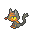火斑喵的蛋×1
另有 1 项获得内容

BracerPoints道具金钱宝可梦

</article>
<article class="sq-row" data-sq-entry data-kind="BP item money" data-search="048 任务048 如期未至的朋友 帮助满金市精灵中心的露营少女找到她的朋友. TM77×1 完成奖励 BracerPoints 3点 完成奖励 金钱4000元 完成奖励 满金市 50.3 满金市 56.15 满金市 50.3 点数 积分 BP BracerPoints">
048

<a class="sq-title" href="048/">如期未至的朋友</a>
帮助满金市精灵中心的露营少女找到她的朋友.

TM77×1

BracerPoints道具金钱

</article>
<article class="sq-row" data-sq-entry data-kind="BP item money" data-search="049 任务049 失踪的父亲 帮助满金市的玛琳找到在桐树林失踪的父亲. 萄葡果×3 完成奖励 罗子果×3 完成奖励 芳香蘑菇×1 完成奖励 经验糖果S×1 完成奖励 BracerPoints 4点 完成奖励 金钱5000元 完成奖励 满金市 56.11 桐树林 1.121 桧皮镇 3.69 满金市 56.11 点数 积分 BP BracerPoints">
049

<a class="sq-title" href="049/">失踪的父亲</a>
帮助满金市的玛琳找到在桐树林失踪的父亲.

萄葡果×3
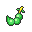罗子果×3
芳香蘑菇×1
另有 1 项获得内容

BracerPoints道具金钱

</article>
<article class="sq-row" data-sq-entry data-kind="BP item money pokemon" data-search="050 任务050 聂梓的签名 帮助满金市的追星女孩得到伽勒尔地区知名创作歌手聂梓的签名. BracerPoints 4点 完成奖励 金钱5000元 完成奖励 毒电婴 Lv.5（携带：爽喉喷雾） 完成奖励 满金市 3.77 满金市 3.77 满金市 55.6 满金市 3.77 点数 积分 BP BracerPoints">
050

<a class="sq-title" href="050/">聂梓的签名</a>
帮助满金市的追星女孩得到伽勒尔地区知名创作歌手聂梓的签名.

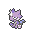毒电婴 Lv.5（携带：爽喉喷雾）

BracerPoints道具金钱宝可梦

</article>
<article class="sq-row" data-sq-entry data-kind="BP money" data-search="051 任务051 时髦的宝可梦? 找到美发兄弟的弟弟所描述的时髦的宝可梦,并给他看看. BracerPoints 3点 完成奖励 金钱4000元 完成奖励 满金市 50.5 满金市 50.5 满金市 50.5 点数 积分 BP BracerPoints">
051

<a class="sq-title" href="051/">时髦的宝可梦?</a>
找到美发兄弟的弟弟所描述的时髦的宝可梦,并给他看看.

BracerPoints / 金钱

BracerPoints金钱

</article>
<article class="sq-row" data-sq-entry data-kind="BP item money unlock" data-search="052 任务052 如梦似幻般的银 寻找有关服装店店员梦中见到的银色宝可梦的线索. 银之护符×2 完成奖励 BracerPoints 8点 完成奖励 金钱10000元 完成奖励 美极套装（海之神主题；服装解锁） 完成服装后获赠 服装对白与服装状态另列为剧情解锁；不能把它误计成背包中的银之护符。 满金市 50.11 缘朱市 48.1 满金市 50.11 满金市 50.11 浅葱市 3.72 湛蓝市 49.1 满金市 50.11 点数 积分 BP BracerPoints 解锁">
052

<a class="sq-title" href="052/">如梦似幻般的银</a>
寻找有关服装店店员梦中见到的银色宝可梦的线索.

美极套装（海之神主题；服装解锁）
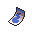银之护符×2

BracerPoints道具金钱功能与服装解锁

</article>
<article class="sq-row" data-sq-entry data-kind="BP item money" data-search="053 任务053 失散的过动猿 帮助搬家公司的员工找到走散的过动猿. TM115×1 完成奖励 BracerPoints 4点 完成奖励 金钱4000元 完成奖励 满金市 3.78 满金市 50.36 满金市 50.36 满金市 3.78 点数 积分 BP BracerPoints">
053

<a class="sq-title" href="053/">失散的过动猿</a>
帮助搬家公司的员工找到走散的过动猿.

TM115×1

BracerPoints道具金钱

</article>
<article class="sq-row" data-sq-entry data-kind="BP item money" data-search="054 任务054 孩子一生平安 帮助满金市的一家人去桐树林祠堂供奉森林之神时拉比. 得文的物品×1 任务途中领取（待供奉的包裹） 水晶护符×1 完成奖励 金之护符×1 完成奖励 银之护符×1 完成奖励 BracerPoints 5点 完成奖励 金钱5000元 完成奖励 满金市 50.39 桐树林 1.121 桐树林 1.121 满金市 50.39 点数 积分 BP BracerPoints">
054

<a class="sq-title" href="054/">孩子一生平安</a>
帮助满金市的一家人去桐树林祠堂供奉森林之神时拉比.

得文的物品×1
水晶护符×1
金之护符×1
另有 1 项获得内容

BracerPoints道具金钱

</article>
<article class="sq-row" data-sq-entry data-kind="BP item money" data-search="055 任务055 奇怪的树 解决挡在36号道路的奇怪的树. 树果×1（种类由脚本变量决定） 后续：每日树果（不同入口，非累计） 树果培育皿×1 完成奖励 橙橙果×3 完成奖励 桃桃果×3 完成奖励 金钱5000元 完成奖励 BracerPoints 4点 完成奖励 满金市 50.22 满金市 50.22 点数 积分 BP BracerPoints">
055

<a class="sq-title" href="055/">奇怪的树</a>
解决挡在36号道路的奇怪的树.

树果×1（种类由脚本变量决定）
树果培育皿×1
橙橙果×3
另有 1 项获得内容

BracerPoints道具金钱

</article>
<article class="sq-row" data-sq-entry data-kind="BP item money" data-search="056 任务056 遗失的玩偶 帮助满金市地下商业街的富家少爷找到遗失的玩偶. 皮可西玩偶×1 任务途中领取（并非目标玩偶） 大师球×1 完成奖励 金色王冠×1 完成奖励 BracerPoints 8点 完成奖励 金钱10000元 完成奖励 银色王冠×1 后续：夏日祭求婚后致谢 金珠×1 后续：夏日祭求婚后致谢 满金市 50.8 满金市 50.20 满金市 50.20 缘朱市 55.33 满金市 50.8 点数 积分 BP BracerPoints">
056

<a class="sq-title" href="056/">遗失的玩偶</a>
帮助满金市地下商业街的富家少爷找到遗失的玩偶.

皮可西玩偶×1
大师球×1
金色王冠×1
另有 2 项获得内容

BracerPoints道具金钱

</article>
<article class="sq-row" data-sq-entry data-kind="BP item money" data-search="057 任务057 传递信件 帮助35号道路的警卫给31号道路的朋友送信. 信件×1 接取时领取（待递送信件） HP增强剂×1 后续：回访35号道路警卫 TM44×1 完成奖励 经验糖果S×1 完成奖励 BracerPoints 5点 完成奖励 金钱5000元 完成奖励 35号道路 44.8 31号道路 3.83 35号道路 44.8 点数 积分 BP BracerPoints">
057

<a class="sq-title" href="057/">传递信件</a>
帮助35号道路的警卫给31号道路的朋友送信.

信件×1
HP增强剂×1
TM44×1
另有 1 项获得内容

BracerPoints道具金钱

</article>
<article class="sq-row" data-sq-entry data-kind="BP money pokemon" data-search="058 任务058 五彩斑斓的头巾 帮助梅丽莎收集五种颜色的头巾. 丑丑鱼 Lv.20（携带：无） 完成奖励 BracerPoints 10点 完成奖励 金钱10000元 完成奖励 丑丑鱼Lv.20，无携带道具。 满金市 4.151 满金市 35.4 点数 积分 BP BracerPoints">
058

<a class="sq-title" href="058/">五彩斑斓的头巾</a>
帮助梅丽莎收集五种颜色的头巾.

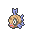丑丑鱼 Lv.20（携带：无）

BracerPoints金钱宝可梦

</article>
<article class="sq-row" data-sq-entry data-kind="BP item money pokemon" data-search="059 任务059 生病的呆呆兽 带来自伽勒尔的留学生前往呆呆兽之井. 伽勒尔呆呆兽的蛋×1 完成奖励 伽勒豆蔻手环×1 完成奖励 伽勒豆蔻花圈×1 完成奖励 BracerPoints 3点 完成奖励 金钱4000元 完成奖励 物种槽1215为伽勒尔呆呆兽，赠送形式是蛋；没有给定孵化后的等级参数。 满金市 3.76 桧皮镇 3.69 桧皮镇 3.69 桧皮镇 3.69 桧皮镇 3.69 桧皮镇 3.69 满金市 3.76 缘朱市 55.33 呆呆兽之井 55.60 满金市 3.76 点数 积分 BP BracerPoints">
059

<a class="sq-title" href="059/">生病的呆呆兽</a>
带来自伽勒尔的留学生前往呆呆兽之井.

伽勒尔呆呆兽的蛋×1
伽勒豆蔻手环×1
伽勒豆蔻花圈×1

BracerPoints道具金钱宝可梦

</article>
<article class="sq-row" data-sq-entry data-kind="BP item money" data-search="060 任务060 头号球迷的朝圣 带阿球拜访桧皮镇的钢铁先生. 究极球×5 完成奖励 梦境球×5 完成奖励 BracerPoints 4点 完成奖励 金钱4000元 完成奖励 贵重球×5 后续阿球对战：随机一种（各分支互斥） 黑暗球×5 后续阿球对战：随机一种（各分支互斥） 治愈球×5 后续阿球对战：随机一种（各分支互斥） 先机球×5 后续阿球对战：随机一种（各分支互斥） 狩猎球×5 后续阿球对战：随机一种（各分支互斥） 纪念球×5 后续阿球对战：随机一种（各分支互斥） 究极球×5 后续阿球对战：随机一种（各分支互斥） 梦境球×5 后续阿球对战：随机一种（各分支互斥） 豪华球×5 后续阿球对战：随机一种（各分支互斥） 捕网球×5 后续阿球对战：随机一种（各分支互斥） 潜水球×5 后续阿球对战：随机一种（各分支互斥） 巢穴球×5 后续阿球对战：随机一种（各分支互斥） 重复球×5 后续阿球对战：随机一种（各分支互斥） 计时球×5 后续阿球对战：随机一种（各分支互斥） 后续阿球对战按random 14选择一种球×5，十四种互斥，不是一次各送五个；拜访钢铁本身固定给究极球×5、梦境球×5。 满金市 50.9 桧皮镇 47.2 桧皮镇 47.2 桧皮镇 47.2 满金市 50.9 点数 积分 BP BracerPoints">
060

<a class="sq-title" href="060/">头号球迷的朝圣</a>
带阿球拜访桧皮镇的钢铁先生.

究极球×5
梦境球×5
贵重球×5
另有 13 项获得内容

BracerPoints道具金钱

</article>
<article class="sq-row" data-sq-entry data-kind="pokemon" data-search="061 任务061 满金Cos大会!? 说服岩铁先生带孙女去参加满金市的CosPlay大会. 图图犬 Lv.20（携带：无） 完成奖励 保留已编入Cos大会颁奖脚本的Lv.20图图犬（物种槽1404），不再单列两个未实装的同名支线；未见独立BP或金钱指令。 桧皮镇 47.2 满金市 52.37 若叶镇 43.0 桧皮镇 47.2 桧皮镇 47.2 桧皮镇 47.2 满金市 52.36 桧皮镇 47.2">
061

<a class="sq-title" href="061/">满金Cos大会!?</a>
说服岩铁先生带孙女去参加满金市的CosPlay大会.

图图犬 Lv.20（携带：无）

宝可梦

</article>
<article class="sq-row" data-sq-entry data-kind="BP item money" data-search="062 任务062 怯场的男友 通过大师级华丽大赛,鼓励华丽大赛会场的少女的男友. 经验糖果S×3 途中：鼓励男友后 黄色头巾×1 完成奖励 BracerPoints 5点 完成奖励 金钱6000元 完成奖励 满金市 4.151 满金市 4.151 满金市 35.4 点数 积分 BP BracerPoints">
062

<a class="sq-title" href="062/">怯场的男友</a>
通过大师级华丽大赛,鼓励华丽大赛会场的少女的男友.

经验糖果S×3
黄色头巾×1

BracerPoints道具金钱

</article>
<article class="sq-row" data-sq-entry data-kind="BP item money pokemon" data-search="063 任务063 胡桃的风景特辑 替胡桃拍下喇叭芽之塔,擂钵山山顶,寂静之丘顶端和海之彼岸四个地方的绝景照片. 经验糖果S×3 完成奖励 卡比丘×2 完成奖励 催眠貘 Lv.20（携带：无） 完成奖励 BracerPoints 15点 完成奖励 金钱10000元 完成奖励 满金市 50.24 喇叭芽之塔 52.2 寂静之丘 56.40 海之彼岸 56.41 擂钵山 56.42 宝可梦联盟 1.79 满金市 50.24 点数 积分 BP BracerPoints">
063

<a class="sq-title" href="063/">胡桃的风景特辑</a>
替胡桃拍下喇叭芽之塔,擂钵山山顶,寂静之丘顶端和海之彼岸四个地方的绝景照片.

经验糖果S×3
卡比丘×2
催眠貘 Lv.20（携带：无）

BracerPoints道具金钱宝可梦

</article>
<article class="sq-row" data-sq-entry data-kind="BP item money" data-search="064 任务064 消失的正辉 帮助正辉的妹妹寻找消失的正辉. 同步器×1 完成奖励 BracerPoints 10点 未首次辨认正确 金钱5000元 未首次辨认正确 BracerPoints 25点 首次辨认正确 金钱10000元 首次辨认正确 两档互斥：首次辨认正确为25BP＋10000元；普通分支为10BP＋5000元。同步器两档都发，不累计为35BP。 满金市 50.31 满金市 50.31 43号道路 3.99 真新镇 52.40 满金市 50.31 真新镇 52.38 真新镇 52.39 满金市 50.31 点数 积分 BP BracerPoints">
064

<a class="sq-title" href="064/">消失的正辉</a>
帮助正辉的妹妹寻找消失的正辉.

同步器×1

BracerPoints道具金钱

</article>
<article class="sq-row" data-sq-entry data-kind="BP mega money" data-search="065 任务065 闪闪发光的误会 解除勾魂眼与小碎钻之间闪闪发光的误会. 金钱6000元 完成奖励 BracerPoints 6点 完成奖励 勾魂眼超级进化波动 完成奖励 额外解锁勾魂眼超级进化波动。 城都矿山 51.9 城都矿山 51.9 点数 积分 BP BracerPoints Mega 超级进化 波动">
065

<a class="sq-title" href="065/">闪闪发光的误会</a>
解除勾魂眼与小碎钻之间闪闪发光的误会.

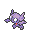勾魂眼超级进化波动

BracerPointsMega 波动金钱

</article>
<article class="sq-row" data-sq-entry data-kind="BP item money pokemon" data-search="066 任务066 姿态各异的舞者 帮助缘朱市的少女找到舞伴. 花舞鸟（形态由变量决定） Lv.20（携带：甜甜蜜） 完成奖励 BracerPoints 4点 完成奖励 金钱4000元 完成奖励 花舞鸟Lv.20，携带甜甜蜜；形态由变量0x4019减0x100后传入givepokemon，不能把变量0x8004当成物种32772。 缘朱市 3.70 缘朱市 52.5 缘朱市 48.5 缘朱市 48.5 缘朱市 48.5 缘朱市 48.7 缘朱市 3.70 缘朱市 3.70 点数 积分 BP BracerPoints">
066

<a class="sq-title" href="066/">姿态各异的舞者</a>
帮助缘朱市的少女找到舞伴.

花舞鸟（形态由变量决定） Lv.20（携带：甜甜蜜）

BracerPoints道具金钱宝可梦

</article>
<article class="sq-row" data-sq-entry data-kind="BP item money" data-search="067 任务067 遗失的钥匙 使用探宝器帮助缘朱市的男性找到家里的钥匙. 探宝器×1 接取时获得 招式学习器56×1 完成奖励 BracerPoints 3点 完成奖励 金钱4000元 完成奖励 经验糖果S×1 完成奖励 探宝器在接取时发放；结算另发TM56、经验糖果S、金钱与点数。 缘朱市 3.70 缘朱市 3.70 点数 积分 BP BracerPoints">
067

<a class="sq-title" href="067/">遗失的钥匙</a>
使用探宝器帮助缘朱市的男性找到家里的钥匙.

探宝器×1
招式学习器56×1
经验糖果S×1

BracerPoints道具金钱

</article>
<article class="sq-row" data-sq-entry data-kind="BP item money" data-search="068 任务068 卖假货的奸商 找到缘朱市卖假货的奸商并惩罚他. 美丽之羽×4 完成奖励 经验糖果S×2 完成奖励 金钱4000元 完成奖励 BracerPoints 4点 完成奖励 美丽之羽×1 花10000元购买的假羽毛（非奖励） 金钱10000元 奸商退回购买款（非净收益） 体力之羽×1 奸商对峙后的额外补偿 肌力之羽×1 奸商对峙后的额外补偿 抵抗之羽×1 奸商对峙后的额外补偿 智力之羽×1 奸商对峙后的额外补偿 精神之羽×1 奸商对峙后的额外补偿 瞬发之羽×1 奸商对峙后的额外补偿 奸商退款10000元对应先前购买支出，单列退款；六种羽毛各1个是对峙后的补偿，不与委托人4个美丽之羽混淆。 缘朱市 48.6 缘朱市 3.70 缘朱市 3.70 32号道路 3.84 缘朱市 48.6 点数 积分 BP BracerPoints">
068

<a class="sq-title" href="068/">卖假货的奸商</a>
找到缘朱市卖假货的奸商并惩罚他.

美丽之羽×4
经验糖果S×2
美丽之羽×1
另有 6 项获得内容

BracerPoints道具金钱

</article>
<article class="sq-row" data-sq-entry data-kind="BP item money" data-search="069 任务069 像气球的宝可梦 调查周三出现在烧焦塔门口的像气球一样的宝可梦. 灵界之布×1 完成奖励 金钱4000元 完成奖励 BracerPoints 4点 完成奖励 缘朱市 3.70 缘朱市 3.70 点数 积分 BP BracerPoints">
069

<a class="sq-title" href="069/">像气球的宝可梦</a>
调查周三出现在烧焦塔门口的像气球一样的宝可梦.

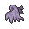灵界之布×1

BracerPoints道具金钱

</article>
<article class="sq-row" data-sq-entry data-kind="BP item money" data-search="070 任务070 逾期图书的回收 帮助图书馆回收逾期的图书. TM87×1 完成奖励 经验糖果S×1 完成奖励 BracerPoints 4点 完成奖励 金钱4000元 完成奖励 缘朱市 52.5 缘朱市 48.0 缘朱市 48.0 缘朱市 52.5 缘朱市 48.1 缘朱市 52.5 点数 积分 BP BracerPoints">
070

<a class="sq-title" href="070/">逾期图书的回收</a>
帮助图书馆回收逾期的图书.

TM87×1
经验糖果S×1

BracerPoints道具金钱

</article>
<article class="sq-row" data-sq-entry data-kind="BP item money unlock" data-search="071 任务071 遥远的约定 帮助缘朱市的女孩实现和朋友的遥远约定. 经验糖果S×2 完成奖励 金钱5000元 完成奖励 BracerPoints 5点 完成奖励 美极套装（水君主题；服装解锁） 完成奖励 另有美极套装的服装解锁；不是giveitem背包道具。 缘朱市 4.147 缘朱市 52.5 缘朱市 3.70 缘朱市 35.0 点数 积分 BP BracerPoints 解锁">
071

<a class="sq-title" href="071/">遥远的约定</a>
帮助缘朱市的女孩实现和朋友的遥远约定.

美极套装（水君主题；服装解锁）
经验糖果S×2

BracerPoints道具金钱功能与服装解锁

</article>
<article class="sq-row" data-sq-entry data-kind="BP item money" data-search="072 任务072 迷路的小锯鳄 帮夏日祭上迷路的小锯鳄找到主人. 经验糖果S×2 完成奖励 卡比丘×1 完成奖励 BracerPoints 8点 完成奖励 金钱6000元 完成奖励 缘朱市 55.34 缘朱市 3.70 点数 积分 BP BracerPoints">
072

<a class="sq-title" href="072/">迷路的小锯鳄</a>
帮夏日祭上迷路的小锯鳄找到主人.

经验糖果S×2
卡比丘×1

BracerPoints道具金钱

</article>
<article class="sq-row" data-sq-entry data-kind="BP item money" data-search="073 任务073 没精神的大奶罐 帮助哞哞牧场的大奶罐重新恢复精神. TM120×1 完成奖励 BracerPoints 4点 完成奖励 金钱4000元 完成奖励 39号道路 52.6 39号道路 52.7 39号道路 52.6 点数 积分 BP BracerPoints">
073

<a class="sq-title" href="073/">没精神的大奶罐</a>
帮助哞哞牧场的大奶罐重新恢复精神.

TM120×1

BracerPoints道具金钱

</article>
<article class="sq-row" data-sq-entry data-kind="BP item money pokemon" data-search="074 任务074 帕底亚的礼物梦 帮助卡吉镇精灵中心的帕底亚商人寻找拥有着给予精神的红色宝可梦. 乌波 Lv.20（携带：无） 完成奖励 经验糖果S×2 完成奖励 金钱4000元 完成奖励 BracerPoints 3点 完成奖励 乌波为脚本指定物种槽258；当前ROM显示名为乌波，来自帕底亚商人的赠礼。 卡吉镇 53.1 卡吉镇 53.1 点数 积分 BP BracerPoints">
074

<a class="sq-title" href="074/">帕底亚的礼物梦</a>
帮助卡吉镇精灵中心的帕底亚商人寻找拥有着给予精神的红色宝可梦.

乌波 Lv.20（携带：无）
经验糖果S×2

BracerPoints道具金钱宝可梦

</article>
<article class="sq-row" data-sq-entry data-kind="BP item money" data-search="075 任务075 非现世的气息 调查每周日出现在擂钵山深处的非现世的气息. 锐利之牙×1 完成奖励 BracerPoints 4点 完成奖励 金钱4000元 完成奖励 卡吉镇 53.1 卡吉镇 53.1 点数 积分 BP BracerPoints">
075

<a class="sq-title" href="075/">非现世的气息</a>
调查每周日出现在擂钵山深处的非现世的气息.

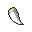锐利之牙×1

BracerPoints道具金钱

</article>
<article class="sq-row" data-sq-entry data-kind="BP item money" data-search="076 任务076 错位的忍道 帮助外来的忍者寻找藏匿在宝可梦中心的长老. 烟雾球×5 完成奖励 冰冷岩石×1 完成奖励 经验糖果S×1 完成奖励 金钱5000元 完成奖励 BracerPoints 4点 完成奖励 卡吉镇 3.74 卡吉镇 53.1 卡吉镇 3.74 点数 积分 BP BracerPoints">
076

<a class="sq-title" href="076/">错位的忍道</a>
帮助外来的忍者寻找藏匿在宝可梦中心的长老.

烟雾球×5
冰冷岩石×1
经验糖果S×1

BracerPoints道具金钱

</article>
<article class="sq-row" data-sq-entry data-kind="BP item money unlock" data-search="077 任务077 忍法！捉迷藏 和卡吉镇的忍者来一场捉迷藏吧! 经验糖果S×1 完成奖励 金钱7000元 完成奖励 BracerPoints 5点 完成奖励 毒菱招式教学 完成捉迷藏后，前往见习忍者家中学习 额外开放毒菱教学。 卡吉镇 53.0 卡吉镇 3.74 卡吉镇 53.2 卡吉镇 53.1 卡吉镇 53.0 点数 积分 BP BracerPoints 解锁">
077

<a class="sq-title" href="077/">忍法！捉迷藏</a>
和卡吉镇的忍者来一场捉迷藏吧!

毒菱招式教学
经验糖果S×1

BracerPoints道具金钱功能与服装解锁

</article>
<article class="sq-row" data-sq-entry data-kind="BP item money" data-search="078 任务078 外卖订单的配送 帮助浅葱市餐厅的老板配送外卖订单. 幸运蛋×1 完成奖励 BracerPoints 3点 完成奖励 金钱3000元 完成奖励 浅葱市 49.17 40号水路 3.95 浅葱市 49.6 浅葱市 49.8 浅葱市 49.17 点数 积分 BP BracerPoints">
078

<a class="sq-title" href="078/">外卖订单的配送</a>
帮助浅葱市餐厅的老板配送外卖订单.

幸运蛋×1

BracerPoints道具金钱

</article>
<article class="sq-row" data-sq-entry data-kind="BP item money" data-search="079 任务079 白色长裙的女孩 代替浅葱市的水手去见周二出现在灯塔的穿着白色长裙的女孩. 焦点镜×1 完成奖励 BracerPoints 4点 完成奖励 金钱4000元 完成奖励 浅葱市 3.72 浅葱市 3.72 点数 积分 BP BracerPoints">
079

<a class="sq-title" href="079/">白色长裙的女孩</a>
代替浅葱市的水手去见周二出现在灯塔的穿着白色长裙的女孩.

焦点镜×1

BracerPoints道具金钱

</article>
<article class="sq-row" data-sq-entry data-kind="BP item money" data-search="080 任务080 彼岸的宝可梦 探查有关大洋彼岸的宝可梦这一传闻的真相. 粉红头巾×1 完成奖励 金钱3000元 完成奖励 经验糖果S×1 完成奖励 BracerPoints 3点 完成奖励 浅葱市 49.10 浅葱市 49.10 点数 积分 BP BracerPoints">
080

<a class="sq-title" href="080/">彼岸的宝可梦</a>
探查有关大洋彼岸的宝可梦这一传闻的真相.

粉红头巾×1
经验糖果S×1

BracerPoints道具金钱

</article>
<article class="sq-row" data-sq-entry data-kind="BP item money" data-search="081 任务081 海之传说 调查有关海之彼岸的王子的传说. 水之宝石×1 完成奖励 银色王冠×1 完成奖励 经验糖果S×2 完成奖励 BracerPoints 8点 完成奖励 金钱8000元 完成奖励 浅葱市 49.10 缘朱市 52.5 缘朱市 52.5 缘朱市 55.33 缘朱市 55.33 浅葱市 49.10 点数 积分 BP BracerPoints">
081

<a class="sq-title" href="081/">海之传说</a>
调查有关海之彼岸的王子的传说.

水之宝石×1
银色王冠×1
经验糖果S×2

BracerPoints道具金钱

</article>
<article class="sq-row" data-sq-entry data-kind="BP item money pokemon" data-search="082 任务082 电气鼠派对 帮助浅葱市的女孩收集电气鼠宝可梦,组织一场电气鼠派对. 电飞鼠 Lv.20（携带：樱子果） 完成奖励 TM92×1 完成奖励 经验糖果S×2 完成奖励 BracerPoints 5点 完成奖励 金钱5000元 完成奖励 浅葱市 3.72 浅葱市 3.72 不知名遗迹 56.19 40号水路 56.32 浅葱市 3.72 点数 积分 BP BracerPoints">
082

<a class="sq-title" href="082/">电气鼠派对</a>
帮助浅葱市的女孩收集电气鼠宝可梦,组织一场电气鼠派对.

电飞鼠 Lv.20（携带：樱子果）
TM92×1
经验糖果S×2

BracerPoints道具金钱宝可梦

</article>
<article class="sq-row" data-sq-entry data-kind="BP item mega money" data-search="083 任务083 海星连接宇宙 受邀参加通过宝石海星的力量和宇宙交流的集会. 彗星碎片×6 完成奖励 金钱6000元 完成奖励 BracerPoints 6点 完成奖励 宝石海星超级进化波动 完成奖励 额外解锁宝石海星超级进化波动；这不等于givepokemon赠送宝石海星。 浅葱市 3.72 40号水路 52.27 浅葱市 3.72 点数 积分 BP BracerPoints Mega 超级进化 波动">
083

<a class="sq-title" href="083/">海星连接宇宙</a>
受邀参加通过宝石海星的力量和宇宙交流的集会.

宝石海星超级进化波动
彗星碎片×6

BracerPoints道具Mega 波动金钱

</article>
<article class="sq-row" data-sq-entry data-kind="BP item money" data-search="084 任务084 深夜电视异闻录 调查40号道路上方的洋馆中的有关深夜电视的传闻. TM78×1 完成奖励 经验糖果S×2 完成奖励 BracerPoints 4点 完成奖励 金钱4000元 完成奖励 浅葱市 49.8 不知名遗迹 56.21 不知名遗迹 56.21 浅葱市 49.8 浅葱市 49.8 点数 积分 BP BracerPoints">
084

<a class="sq-title" href="084/">深夜电视异闻录</a>
调查40号道路上方的洋馆中的有关深夜电视的传闻.

TM78×1
经验糖果S×2

BracerPoints道具金钱

</article>
<article class="sq-row" data-sq-entry data-kind="BP item money" data-search="085 任务085 不安的太阳珊瑚 探索湛蓝市北面的洞穴,找到太阳珊瑚不安的原因. 复活草×3 完成奖励 BracerPoints 4点 完成奖励 金钱4000元 完成奖励 湛蓝市 3.73 湛蓝市 3.73 点数 积分 BP BracerPoints">
085

<a class="sq-title" href="085/">不安的太阳珊瑚</a>
探索湛蓝市北面的洞穴,找到太阳珊瑚不安的原因.

复活草×3

BracerPoints道具金钱

</article>
<article class="sq-row" data-sq-entry data-kind="BP item money" data-search="086 任务086 黑色的千针鱼 调查41号水路漩涡附近出现黑色千针鱼的传闻. 蓝色头巾×1 完成奖励 BracerPoints 3点 完成奖励 金钱4000元 完成奖励 湛蓝市 4.122 湛蓝市 49.0 41号水路 3.96 41号水路 3.96 41号水路 3.96 41号水路 3.96 湛蓝市 31.0 点数 积分 BP BracerPoints">
086

<a class="sq-title" href="086/">黑色的千针鱼</a>
调查41号水路漩涡附近出现黑色千针鱼的传闻.

蓝色头巾×1

BracerPoints道具金钱

</article>
<article class="sq-row" data-sq-entry data-kind="BP item money pokemon" data-search="087 任务087 被抢走的宝可梦 帮助湛蓝市的收集狂暂时保管他剩下的宝可梦. 壶壶 Lv.15（携带：橙橙果） 完成奖励 BracerPoints 3点 完成奖励 金钱3000元 完成奖励 湛蓝市 49.2 湛蓝市 49.2 点数 积分 BP BracerPoints">
087

<a class="sq-title" href="087/">被抢走的宝可梦</a>
帮助湛蓝市的收集狂暂时保管他剩下的宝可梦.

壶壶 Lv.15（携带：橙橙果）

BracerPoints道具金钱宝可梦

</article>
<article class="sq-row" data-sq-entry data-kind="BP item money" data-search="088 任务088 完美的能量餐 帮助湛蓝市的空手道王去药店拿取调制完美的能量餐所需的材料. 元气粉×1 任务途中领取（待交付药材） 攻击增强剂×1 途中调制完成时分得 力量护腕×1 完成奖励 BracerPoints 4点 完成奖励 金钱4000元 完成奖励 湛蓝市 3.73 湛蓝市 49.4 湛蓝市 3.73 点数 积分 BP BracerPoints">
088

<a class="sq-title" href="088/">完美的能量餐</a>
帮助湛蓝市的空手道王去药店拿取调制完美的能量餐所需的材料.

元气粉×1
攻击增强剂×1
力量护腕×1

BracerPoints道具金钱

</article>
<article class="sq-row" data-sq-entry data-kind="BP item money pokemon" data-search="089 任务089 海浪卷走的乌波 帮助吉野市的山男寻找被海浪卷往51号水路方向的乌波. 索罗亚 Lv.20（携带：甜蜜球） 完成奖励 神秘水滴×1 完成奖励 BracerPoints 4点 完成奖励 金钱5000元 完成奖励 日之石×1 后续：向研究所助手展示爱心球 索罗亚携带的道具在ROM名为“甜蜜球”，对白称“爱心球”；数量和物种按指令记录。任务090碑文的4BP／5000元不叠入本任务。 吉野市 3.67 幻影之森 56.43 若叶镇 43.6 若叶镇 43.6 吉野市 3.67 点数 积分 BP BracerPoints">
089

<a class="sq-title" href="089/">海浪卷走的乌波</a>
帮助吉野市的山男寻找被海浪卷往51号水路方向的乌波.

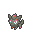索罗亚 Lv.20（携带：甜蜜球）
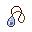神秘水滴×1
日之石×1

BracerPoints道具金钱宝可梦

</article>
<article class="sq-row" data-sq-entry data-kind="BP money" data-search="090 任务090 漆黑的魅影 魅影终将消散,但信念与爱永不熄灭. BracerPoints 4点 完成奖励 金钱5000元 完成奖励 碑文对白没有报酬提示，但实际脚本写入4BP、5000元，因此本次补列。 幻影之森 56.43 幻影之森 56.43 点数 积分 BP BracerPoints">
090

<a class="sq-title" href="090/">漆黑的魅影</a>
魅影终将消散,但信念与爱永不熄灭.

BracerPoints / 金钱

BracerPoints金钱

</article>
<article class="sq-row" data-sq-entry data-kind="BP money pokemon" data-search="091 任务091 亚玄的修炼 和亚玄一起寻找寂静之丘的宝可梦不安的原因. BracerPoints 10点 完成奖励 金钱8000元 完成奖励 利欧路的蛋×1 完成奖励 补查地图56.40的第二类进入脚本0x08EC591F：合影后的收尾实际发放利欧路的蛋、10BP和8000元。该入口未直接写任务Flag，原提取漏关联；此处已按实际giveegg与加点、加钱指令补齐。 寂静之丘 1.98 寂静之丘 1.98 寂静之丘 56.40 寂静之丘 56.40 寂静之丘 1.98 点数 积分 BP BracerPoints">
091

<a class="sq-title" href="091/">亚玄的修炼</a>
和亚玄一起寻找寂静之丘的宝可梦不安的原因.

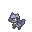利欧路的蛋×1

BracerPoints金钱宝可梦

</article>
<article class="sq-row" data-sq-entry data-kind="BP mega money unlock" data-search="092 任务092 波导的勇者 孵化亚玄赠予的宝可梦蛋,并将进化后的宝可梦给亚玄看看. BracerPoints 10点 完成奖励 金钱8000元 完成奖励 路卡利欧超级进化波动 完成奖励 亚玄的电话号码 剧情登记电话时 额外解锁路卡利欧超级进化波动并登记亚玄电话；展示的路卡利欧是玩家已持有的，不是新赠送。 寂静之丘 56.40 寂静之丘 56.40 点数 积分 BP BracerPoints Mega 超级进化 波动 解锁">
092

<a class="sq-title" href="092/">波导的勇者</a>
孵化亚玄赠予的宝可梦蛋,并将进化后的宝可梦给亚玄看看.

路卡利欧超级进化波动
亚玄的电话号码

BracerPointsMega 波动金钱功能与服装解锁

</article>
<article class="sq-row" data-sq-entry data-kind="BP item money unlock" data-search="093 任务093 被遗忘的遗忘 帮助遗忘爷爷回忆起遗忘招式的方法. 水晶护符×1 完成奖励 经验糖果S×3 完成奖励 BracerPoints 4点 完成奖励 金钱4000元 完成奖励 免费遗忘招式服务 完成后开放 完成后开放免费遗忘招式服务。 烟墨市 4.132 烟墨市 4.132 浅红市 4.71 烟墨市 32.3 点数 积分 BP BracerPoints 解锁">
093

<a class="sq-title" href="093/">被遗忘的遗忘</a>
帮助遗忘爷爷回忆起遗忘招式的方法.

免费遗忘招式服务
水晶护符×1
经验糖果S×3

BracerPoints道具金钱功能与服装解锁

</article>
<article class="sq-row" data-sq-entry data-kind="BP item money unlock" data-search="094 任务094 收集玻璃哨 帮助布尔乔瓦先生收集五种颜色的玻璃哨. 龙之宝石×1 完成奖励 BracerPoints 5点 完成奖励 金钱15000元 完成奖励 宝石购买服务（非免费赠送） 完成后开放；后续宝石需另行购买 完成后可购买宝石；后续购买不能计作任务赠礼。 烟墨市 4.129 烟墨市 32.0 点数 积分 BP BracerPoints 解锁">
094

<a class="sq-title" href="094/">收集玻璃哨</a>
帮助布尔乔瓦先生收集五种颜色的玻璃哨.

宝石购买服务（非免费赠送）
龙之宝石×1

BracerPoints道具金钱功能与服装解锁

</article>
<article class="sq-row" data-sq-entry data-kind="BP item money" data-search="095 任务095 是谁在捣乱? 寻找周六出现在龙穴的捣乱的宝可梦. 胆怯球×1 完成奖励 BracerPoints 4点 完成奖励 金钱4000元 完成奖励 烟墨市 4.131 烟墨市 32.2 点数 积分 BP BracerPoints">
095

<a class="sq-title" href="095/">是谁在捣乱?</a>
寻找周六出现在龙穴的捣乱的宝可梦.

胆怯球×1

BracerPoints道具金钱

</article>
<article class="sq-row" data-sq-entry data-kind="BP money" data-search="096 任务096 被解开的封印 找到楔石,并前往黑暗洞穴深处的深坑. BracerPoints 5点 完成奖励 金钱108元 完成奖励 烟墨市 3.71 黑暗洞穴 1.125 烟墨市 3.71 点数 积分 BP BracerPoints">
096

<a class="sq-title" href="096/">被解开的封印</a>
找到楔石,并前往黑暗洞穴深处的深坑.

BracerPoints / 金钱

BracerPoints金钱

</article>

没有匹配结果，请更换关键词或奖励类型。

[数据说明与收录范围](sources.md)
